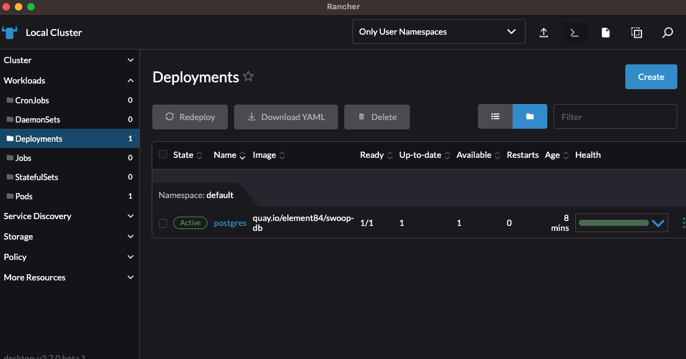
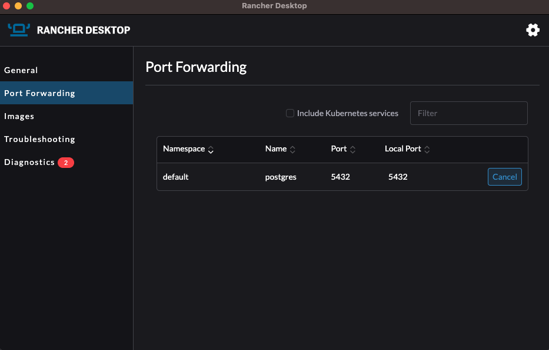

# Deployment

This helm chart will deploy Postgres as a state database for [SWOOP API](https://github.com/Element84/swoop) onto a Kubernetes cluster.

To install the chart, do:

`helm repo add e84 https://element84.github.io/filmdrop-k8s-helm-charts`

and

`helm install postgres e84/postgres`

Once the chart has been deployed, you should see at least 1 deployment for postgres.
<br></br>
<p align="center">
  
</p>
<br></br>

In order to start using the services used by this helm chart, you will need to port-forward `postgres` onto localhost port `6543`.
<br></br>
<p align="center">
  
</p>
<br></br>

## Initializing SWOOP Database and running migrations

For a comprehensive set of steps initialize and use the postgres database, please refer to the swoop-db repo [https://github.com/Element84/swoop-db](https://github.com/Element84/swoop-db).

If you want sample data to test the API, first install swoop-db from pip, export environment variables, and then run the migrations and import the fixtures like the following:

helm get values postgres -a -o json | jq -r .postgres.service.dbUser | base64 --decode

helm get values postgres -a -o json | jq -r .postgres.service.dbPassword | base64 --decode

swoop-db
After clonning the swoop repo, execute the following commands from the top level contents of the repo in your local terminal:
```
$ pip install swoop.db
$ export PGHOST="127.0.0.1"
$ export PGUSER="`helm get values postgres -a -o json | jq -r .postgres.service.dbUser | base64 --decode`"
$ export PGPASSWORD="`helm get values postgres -a -o json | jq -r .postgres.service.dbPassword | base64 --decode`"
$ export PGPORT="6543"
$ export PGDATABASE="swoop"
$ export SWOOP_DB_SCHEMA_VERSION_TABLE="swoop.schema_version"
$ swoop-db up
```

## Uninstall postgres

To uninstall the release, do `helm uninstall postgres`.
