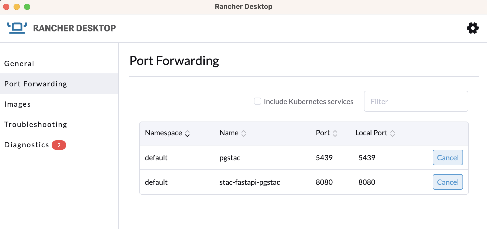

# Deployment

This helm chart will deploy [STAC Fast-API](https://github.com/stac-utils/stac-fastapi) onto a Kubernetes cluster.

To install the chart, do:

`helm repo add e84 https://element84.github.io/filmdrop-k8s-helm-charts`

and

`helm install stac e84/stac-fastapi`


Once the chart has been deployed, port-forward the `pgstac` service onto the localhost port `5439`. Then, port-forward the `stac-fastapi-pgstac` service onto another localhost port, such as `8080`. This can be done in Rancher Desktop via the 'Port-Forwarding' tab or via the `kubectl port-forward` command (see below).
<br></br>
<p align="center">
  
</p>
<br></br>

`kubectl port-forward service/pgstac 5439:5439`

`kubectl port-forward service/stac-fastapi-pgstac 8080:8080`
<br></br>
Navigate to `http://localhost:8080/` in a web browser, where you will then see the STAC Fast-API landing page.
<br></br>
You can view the database along with all of its schemas, functions, and tables in PgAdmin (make sure to use the port `5439` in the database server connection parameters).
<br></br>

# Populating stac-fastapi

After port forwarding stac-fastapi and pgstac
```
kubectl port-forward service/pgstac 5439:5439
kubectl port-forward service/stac-fastapi-pgstac 8080:8080
```

## Adding a collection

For full documentation for stac-fastapi, please visit the [Stac-FastAPI Official Documentation](https://stac-utils.github.io/stac-fastapi/).

The information below is intended to provide an example of how to use the stac-fastapi collections endpoint to add a sample collection `collection_1`. In your particular, use case, you will need to replace the body payload json with the information of your collection.

To create sample `collection_1` via curl:
```
curl -0 -v -X POST http://localhost:8080/collections \
-H 'Content-Type: application/json; charset=utf-8' \
--data-binary @- << EOF
{
    "id": "collection_1",
    "stac_extensions": [],
    "type": "Collection",
    "description": "Landat 8 imagery radiometrically calibrated and orthorectified using gound points and Digital Elevation Model (DEM) data to correct relief displacement.",
    "stac_version": "1.0.0",
    "license": "PDDL-1.0",
    "summaries": {
        "platform": [
            "landsat-8"
        ],
        "instruments": [
            "oli",
            "tirs"
        ],
        "gsd": [
            30
        ],
        "eo:bands": [
            {
                "name": "B1",
                "common_name": "coastal",
                "center_wavelength": 0.44,
                "full_width_half_max": 0.02
            },
            {
                "name": "B2",
                "common_name": "blue",
                "center_wavelength": 0.48,
                "full_width_half_max": 0.06
            },
            {
                "name": "B3",
                "common_name": "green",
                "center_wavelength": 0.56,
                "full_width_half_max": 0.06
            },
            {
                "name": "B4",
                "common_name": "red",
                "center_wavelength": 0.65,
                "full_width_half_max": 0.04
            },
            {
                "name": "B5",
                "common_name": "nir",
                "center_wavelength": 0.86,
                "full_width_half_max": 0.03
            },
            {
                "name": "B6",
                "common_name": "swir16",
                "center_wavelength": 1.6,
                "full_width_half_max": 0.08
            },
            {
                "name": "B7",
                "common_name": "swir22",
                "center_wavelength": 2.2,
                "full_width_half_max": 0.2
            },
            {
                "name": "B8",
                "common_name": "pan",
                "center_wavelength": 0.59,
                "full_width_half_max": 0.18
            },
            {
                "name": "B9",
                "common_name": "cirrus",
                "center_wavelength": 1.37,
                "full_width_half_max": 0.02
            },
            {
                "name": "B10",
                "common_name": "lwir11",
                "center_wavelength": 10.9,
                "full_width_half_max": 0.8
            },
            {
                "name": "B11",
                "common_name": "lwir12",
                "center_wavelength": 12,
                "full_width_half_max": 1
            }
        ]
    },
    "extent": {
        "spatial": {
            "bbox": [
                [
                    -180.0,
                    -90.0,
                    180.0,
                    90.0
                ]
            ]
        },
        "temporal": {
            "interval": [
                [
                    "2013-06-01",
                    null
                ]
            ]
        }
    },
    "links": [
        {
            "rel": "license",
            "href": "https://creativecommons.org/licenses/publicdomain/",
            "title": "public domain"
        }
    ],
    "title": "Landsat 8 L1",
    "keywords": [
        "landsat",
        "earth observation",
        "usgs"
    ],
    "providers": [
        {
            "name": "USGS",
            "roles": [
                "producer"
            ],
            "url": "https://landsat.usgs.gov/"
        },
        {
            "name": "Planet Labs",
            "roles": [
                "processor"
            ],
            "url": "https://github.com/landsat-pds/landsat_ingestor"
        },
        {
            "name": "AWS",
            "roles": [
                "host"
            ],
            "url": "https://landsatonaws.com/"
        },
        {
            "name": "Development Seed",
            "roles": [
                "processor"
            ],
            "url": "https://github.com/sat-utils/sat-api"
        },
        {
            "name": "Earth Search by Element84",
            "description": "API of Earth on AWS datasets",
            "roles": [
                "host"
            ],
            "url": "https://element84.com"
        }
    ]
}
EOF
```

You should see a successful output as a response with the collection information:
```
*   Trying 127.0.0.1:8080...
* Connected to localhost (127.0.0.1) port 8080 (#0)
> POST /collections HTTP/1.0
> Host: localhost:8080
> User-Agent: curl/8.1.2
> Accept: */*
> Content-Type: application/json; charset=utf-8
> Content-Length: 4235
> 
< HTTP/1.1 200 OK
< date: Fri, 18 Aug 2023 16:54:06 GMT
< server: uvicorn
< content-length: 2446
< content-type: application/json
< 
* Connection #0 to host localhost left intact
{"id":"collection_1","stac_extensions":[],"type":"Collection","description":"Landat 8 imagery radiometrically calibrated and orthorectified using gound points and Digital Elevation Model (DEM) data to correct relief displacement.","stac_version":"1.0.0","license":"PDDL-1.0","summaries":{"platform":["landsat-8"],"instruments":["oli","tirs"],"gsd":[30],"eo:bands":[{"name":"B1","common_name":"coastal","center_wavelength":0.44,"full_width_half_max":0.02},{"name":"B2","common_name":"blue","center_wavelength":0.48,"full_width_half_max":0.06},{"name":"B3","common_name":"green","center_wavelength":0.56,"full_width_half_max":0.06},{"name":"B4","common_name":"red","center_wavelength":0.65,"full_width_half_max":0.04},{"name":"B5","common_name":"nir","center_wavelength":0.86,"full_width_half_max":0.03},{"name":"B6","common_name":"swir16","center_wavelength":1.6,"full_width_half_max":0.08},{"name":"B7","common_name":"swir22","center_wavelength":2.2,"full_width_half_max":0.2},{"name":"B8","common_name":"pan","center_wavelength":0.59,"full_width_half_max":0.18},{"name":"B9","common_name":"cirrus","center_wavelength":1.37,"full_width_half_max":0.02},{"name":"B10","common_name":"lwir11","center_wavelength":10.9,"full_width_half_max":0.8},{"name":"B11","common_name":"lwir12","center_wavelength":12,"full_width_half_max":1}]},"extent":{"spatial":{"bbox":[[-180.0,-90.0,180.0,90.0]]},"temporal":{"interval":[["2013-06-01",null]]}},"links":[{"rel":"items","type":"application/geo+json","href":"http://localhost:8080/collections/collection_1/items"},{"rel":"parent","type":"application/json","href":"http://localhost:8080/"},{"rel":"root","type":"application/json","href":"http://localhost:8080/"},{"rel":"self","type":"application/json","href":"http://localhost:8080/collections/collection_1"},{"rel":"license","href":"https://creativecommons.org/licenses/publicdomain/","title":"public domain"}],"title":"Landsat 8 L1","keywords":["landsat","earth observation","usgs"],"providers":[{"name":"USGS","roles":["producer"],"url":"https://landsat.usgs.gov/"},{"name":"Planet Labs","roles":["processor"],"url":"https://github.com/landsat-pds/landsat_ingestor"},{"name":"AWS","roles":["host"],"url":"https://landsatonaws.com/"},{"name":"Development Seed","roles":["processor"],"url":"https://github.com/sat-utils/sat-api"},{"name":"Earth Search by Element84","description":"API of Earth on AWS datasets","roles":["host"],"url":"https://element84.com"}]}%
```

You can view all collections available in stac-fastapi via
```
$ curl http://localhost:8080/collections


{"collections":[{"id":"collection_1","type":"Collection","links":[{"rel":"items","type":"application/geo+json","href":"http://localhost:8080/collections/collection_1/items"},{"rel":"parent","type":"application/json","href":"http://localhost:8080/"},{"rel":"root","type":"application/json","href":"http://localhost:8080/"},{"rel":"self","type":"application/json","href":"http://localhost:8080/collections/collection_1"},{"rel":"license","href":"https://creativecommons.org/licenses/publicdomain/","title":"public domain"}],"title":"Landsat 8 L1","extent":{"spatial":{"bbox":[[-180.0,-90.0,180.0,90.0]]},"temporal":{"interval":[["2013-06-01",null]]}},"license":"PDDL-1.0","keywords":["landsat","earth observation","usgs"],"providers":[{"url":"https://landsat.usgs.gov/","name":"USGS","roles":["producer"]},{"url":"https://github.com/landsat-pds/landsat_ingestor","name":"Planet Labs","roles":["processor"]},{"url":"https://landsatonaws.com/","name":"AWS","roles":["host"]},{"url":"https://github.com/sat-utils/sat-api","name":"Development Seed","roles":["processor"]},{"url":"https://element84.com","name":"Earth Search by Element84","roles":["host"],"description":"API of Earth on AWS datasets"}],"summaries":{"gsd":[30],"eo:bands":[{"name":"B1","common_name":"coastal","center_wavelength":0.44,"full_width_half_max":0.02},{"name":"B2","common_name":"blue","center_wavelength":0.48,"full_width_half_max":0.06},{"name":"B3","common_name":"green","center_wavelength":0.56,"full_width_half_max":0.06},{"name":"B4","common_name":"red","center_wavelength":0.65,"full_width_half_max":0.04},{"name":"B5","common_name":"nir","center_wavelength":0.86,"full_width_half_max":0.03},{"name":"B6","common_name":"swir16","center_wavelength":1.6,"full_width_half_max":0.08},{"name":"B7","common_name":"swir22","center_wavelength":2.2,"full_width_half_max":0.2},{"name":"B8","common_name":"pan","center_wavelength":0.59,"full_width_half_max":0.18},{"name":"B9","common_name":"cirrus","center_wavelength":1.37,"full_width_half_max":0.02},{"name":"B10","common_name":"lwir11","center_wavelength":10.9,"full_width_half_max":0.8},{"name":"B11","common_name":"lwir12","center_wavelength":12,"full_width_half_max":1}],"platform":["landsat-8"],"instruments":["oli","tirs"]},"description":"Landat 8 imagery radiometrically calibrated and orthorectified using gound points and Digital Elevation Model (DEM) data to correct relief displacement.","stac_version":"1.0.0","stac_extensions":[]}],"links":[{"rel":"root","type":"application/json","href":"http://localhost:8080/"},{"rel":"parent","type":"application/json","href":"http://localhost:8080/"},{"rel":"self","type":"application/json","href":"http://localhost:8080/collections"}]}%  
```
<br></br>

## Adding an item to an existing collection

For full documentation for stac-fastapi, please visit the [Stac-FastAPI Official Documentation](https://stac-utils.github.io/stac-fastapi/).

The information below is intended to provide an example of how to use the stac-fastapi items endpoint to add a sample item `item_1` to an existing collection `collection_1`. In your particular, use case, you will need to replace the body payload json with the information of your item.

To create sample `item_1` via curl:
```
curl -0 -v -X POST http://localhost:8080/collections/collection_1/items \
-H 'Content-Type: application/json; charset=utf-8' \
--data-binary @- << EOF
{
  "type": "Feature",
  "id": "item_1",
  "stac_version": "1.0.0",
  "stac_extensions": [
    "https://stac-extensions.github.io/eo/v1.0.0/schema.json",
    "https://stac-extensions.github.io/projection/v1.0.0/schema.json"
  ],
  "geometry": {
    "coordinates": [
      [
        [
          152.15052873427666,
          -33.82243006904891
        ],
        [
          150.1000346138806,
          -34.257132625788756
        ],
        [
          149.5776607193635,
          -32.514709769700254
        ],
        [
          151.6262528041627,
          -32.08081674221862
        ],
        [
          152.15052873427666,
          -33.82243006904891
        ]
      ]
    ],
    "type": "Polygon"
  },
  "properties": {
    "datetime": "2020-02-12T12:30:22Z",
    "landsat:scene_id": "LC82081612020043LGN00",
    "landsat:row": "161",
    "gsd": 15,
    "eo:bands": [
      {
        "gsd": 30,
        "name": "B1",
        "common_name": "coastal",
        "center_wavelength": 0.44,
        "full_width_half_max": 0.02
      },
      {
        "gsd": 30,
        "name": "B2",
        "common_name": "blue",
        "center_wavelength": 0.48,
        "full_width_half_max": 0.06
      },
      {
        "gsd": 30,
        "name": "B3",
        "common_name": "green",
        "center_wavelength": 0.56,
        "full_width_half_max": 0.06
      },
      {
        "gsd": 30,
        "name": "B4",
        "common_name": "red",
        "center_wavelength": 0.65,
        "full_width_half_max": 0.04
      },
      {
        "gsd": 30,
        "name": "B5",
        "common_name": "nir",
        "center_wavelength": 0.86,
        "full_width_half_max": 0.03
      },
      {
        "gsd": 30,
        "name": "B6",
        "common_name": "swir16",
        "center_wavelength": 1.6,
        "full_width_half_max": 0.08
      },
      {
        "gsd": 30,
        "name": "B7",
        "common_name": "swir22",
        "center_wavelength": 2.2,
        "full_width_half_max": 0.2
      },
      {
        "gsd": 15,
        "name": "B8",
        "common_name": "pan",
        "center_wavelength": 0.59,
        "full_width_half_max": 0.18
      },
      {
        "gsd": 30,
        "name": "B9",
        "common_name": "cirrus",
        "center_wavelength": 1.37,
        "full_width_half_max": 0.02
      },
      {
        "gsd": 100,
        "name": "B10",
        "common_name": "lwir11",
        "center_wavelength": 10.9,
        "full_width_half_max": 0.8
      },
      {
        "gsd": 100,
        "name": "B11",
        "common_name": "lwir12",
        "center_wavelength": 12,
        "full_width_half_max": 1
      }
    ],
    "landsat:revision": "00",
    "view:sun_azimuth": -148.83296771,
    "instrument": "OLI_TIRS",
    "landsat:product_id": "LC08_L1GT_208161_20200212_20200212_01_RT",
    "eo:cloud_cover": 0,
    "landsat:tier": "RT",
    "landsat:processing_level": "L1GT",
    "landsat:column": "208",
    "platform": "landsat-8",
    "proj:epsg": 32756,
    "view:sun_elevation": -37.30791534,
    "view:off_nadir": 0,
    "height": 2500,
    "width": 2500
  },
  "bbox": [
    149.57574,
    -34.25796,
    152.15194,
    -32.07915
  ],
  "collection": "collection_1",
  "assets": {
    "ANG": {
      "href": "https://landsateuwest.blob.core.windows.net/landsat-c2/level-2/standard/oli-tirs/2021/108/066/LC08_L2SP_108066_20210712_20210720_02_T1/LC08_L2SP_108066_20210712_20210720_02_T1_ANG.txt",
      "type": "text/plain",
      "title": "Angle Coefficients File",
      "description": "Collection 2 Level-1 Angle Coefficients File (ANG)"
    },
    "SR_B1": {
      "gsd": 30,
      "href": "https://landsateuwest.blob.core.windows.net/landsat-c2/level-2/standard/oli-tirs/2021/108/066/LC08_L2SP_108066_20210712_20210720_02_T1/LC08_L2SP_108066_20210712_20210720_02_T1_SR_B1.TIF",
      "type": "image/tiff; application=geotiff; profile=cloud-optimized",
      "title": "Coastal/Aerosol Band (B1)",
      "eo:bands": [
        {
          "gsd": 30,
          "name": "SR_B1",
          "common_name": "coastal",
          "center_wavelength": 0.44,
          "full_width_half_max": 0.02
        }
      ],
      "proj:shape": [
        7731,
        7591
      ],
      "description": "Collection 2 Level-2 Coastal/Aerosol Band (B1) Surface Reflectance",
      "proj:transform": [
        30,
        0,
        304185,
        0,
        -30,
        -843585
      ]
    },
    "SR_B2": {
      "gsd": 30,
      "href": "https://landsateuwest.blob.core.windows.net/landsat-c2/level-2/standard/oli-tirs/2021/108/066/LC08_L2SP_108066_20210712_20210720_02_T1/LC08_L2SP_108066_20210712_20210720_02_T1_SR_B2.TIF",
      "type": "image/tiff; application=geotiff; profile=cloud-optimized",
      "title": "Blue Band (B2)",
      "eo:bands": [
        {
          "gsd": 30,
          "name": "SR_B2",
          "common_name": "blue",
          "center_wavelength": 0.48,
          "full_width_half_max": 0.06
        }
      ],
      "proj:shape": [
        7731,
        7591
      ],
      "description": "Collection 2 Level-2 Blue Band (B2) Surface Reflectance",
      "proj:transform": [
        30,
        0,
        304185,
        0,
        -30,
        -843585
      ]
    },
    "SR_B3": {
      "gsd": 30,
      "href": "https://landsateuwest.blob.core.windows.net/landsat-c2/level-2/standard/oli-tirs/2021/108/066/LC08_L2SP_108066_20210712_20210720_02_T1/LC08_L2SP_108066_20210712_20210720_02_T1_SR_B3.TIF",
      "type": "image/tiff; application=geotiff; profile=cloud-optimized",
      "title": "Green Band (B3)",
      "eo:bands": [
        {
          "gsd": 30,
          "name": "SR_B3",
          "common_name": "green",
          "center_wavelength": 0.56,
          "full_width_half_max": 0.06
        }
      ],
      "proj:shape": [
        7731,
        7591
      ],
      "description": "Collection 2 Level-2 Green Band (B3) Surface Reflectance",
      "proj:transform": [
        30,
        0,
        304185,
        0,
        -30,
        -843585
      ]
    },
    "SR_B4": {
      "gsd": 30,
      "href": "https://landsateuwest.blob.core.windows.net/landsat-c2/level-2/standard/oli-tirs/2021/108/066/LC08_L2SP_108066_20210712_20210720_02_T1/LC08_L2SP_108066_20210712_20210720_02_T1_SR_B4.TIF",
      "type": "image/tiff; application=geotiff; profile=cloud-optimized",
      "title": "Red Band (B4)",
      "eo:bands": [
        {
          "gsd": 30,
          "name": "SR_B4",
          "common_name": "red",
          "center_wavelength": 0.65,
          "full_width_half_max": 0.04
        }
      ],
      "proj:shape": [
        7731,
        7591
      ],
      "description": "Collection 2 Level-2 Red Band (B4) Surface Reflectance",
      "proj:transform": [
        30,
        0,
        304185,
        0,
        -30,
        -843585
      ]
    },
    "SR_B5": {
      "gsd": 30,
      "href": "https://landsateuwest.blob.core.windows.net/landsat-c2/level-2/standard/oli-tirs/2021/108/066/LC08_L2SP_108066_20210712_20210720_02_T1/LC08_L2SP_108066_20210712_20210720_02_T1_SR_B5.TIF",
      "type": "image/tiff; application=geotiff; profile=cloud-optimized",
      "title": "Near Infrared Band 0.8 (B5)",
      "eo:bands": [
        {
          "gsd": 30,
          "name": "SR_B5",
          "common_name": "nir08",
          "center_wavelength": 0.86,
          "full_width_half_max": 0.03
        }
      ],
      "proj:shape": [
        7731,
        7591
      ],
      "description": "Collection 2 Level-2 Near Infrared Band 0.8 (B5) Surface Reflectance",
      "proj:transform": [
        30,
        0,
        304185,
        0,
        -30,
        -843585
      ]
    },
    "SR_B6": {
      "gsd": 30,
      "href": "https://landsateuwest.blob.core.windows.net/landsat-c2/level-2/standard/oli-tirs/2021/108/066/LC08_L2SP_108066_20210712_20210720_02_T1/LC08_L2SP_108066_20210712_20210720_02_T1_SR_B6.TIF",
      "type": "image/tiff; application=geotiff; profile=cloud-optimized",
      "title": "Short-wave Infrared Band 1.6 (B6)",
      "eo:bands": [
        {
          "gsd": 30,
          "name": "SR_B6",
          "common_name": "swir16",
          "center_wavelength": 1.6,
          "full_width_half_max": 0.08
        }
      ],
      "proj:shape": [
        7731,
        7591
      ],
      "description": "Collection 2 Level-2 Short-wave Infrared Band 1.6 (B6) Surface Reflectance",
      "proj:transform": [
        30,
        0,
        304185,
        0,
        -30,
        -843585
      ]
    },
    "SR_B7": {
      "gsd": 30,
      "href": "https://landsateuwest.blob.core.windows.net/landsat-c2/level-2/standard/oli-tirs/2021/108/066/LC08_L2SP_108066_20210712_20210720_02_T1/LC08_L2SP_108066_20210712_20210720_02_T1_SR_B7.TIF",
      "type": "image/tiff; application=geotiff; profile=cloud-optimized",
      "title": "Short-wave Infrared Band 2.2 (B7)",
      "eo:bands": [
        {
          "gsd": 30,
          "name": "SR_B7",
          "common_name": "swir22",
          "center_wavelength": 2.2,
          "full_width_half_max": 0.2
        }
      ],
      "proj:shape": [
        7731,
        7591
      ],
      "description": "Collection 2 Level-2 Short-wave Infrared Band 2.2 (B7) Surface Reflectance",
      "proj:transform": [
        30,
        0,
        304185,
        0,
        -30,
        -843585
      ]
    },
    "ST_QA": {
      "gsd": 30,
      "href": "https://landsateuwest.blob.core.windows.net/landsat-c2/level-2/standard/oli-tirs/2021/108/066/LC08_L2SP_108066_20210712_20210720_02_T1/LC08_L2SP_108066_20210712_20210720_02_T1_ST_QA.TIF",
      "type": "image/tiff; application=geotiff; profile=cloud-optimized",
      "title": "Surface Temperature Quality Assessment Band",
      "proj:shape": [
        7731,
        7591
      ],
      "description": "Landsat Collection 2 Level-2 Surface Temperature Band Surface Temperature Product",
      "proj:transform": [
        30,
        0,
        304185,
        0,
        -30,
        -843585
      ]
    },
    "ST_B10": {
      "gsd": 100,
      "href": "https://landsateuwest.blob.core.windows.net/landsat-c2/level-2/standard/oli-tirs/2021/108/066/LC08_L2SP_108066_20210712_20210720_02_T1/LC08_L2SP_108066_20210712_20210720_02_T1_ST_B10.TIF",
      "type": "image/tiff; application=geotiff; profile=cloud-optimized",
      "title": "Surface Temperature Band (B10)",
      "eo:bands": [
        {
          "gsd": 100,
          "name": "ST_B10",
          "common_name": "lwir11",
          "center_wavelength": 10.9,
          "full_width_half_max": 0.8
        }
      ],
      "proj:shape": [
        7731,
        7591
      ],
      "description": "Landsat Collection 2 Level-2 Surface Temperature Band (B10) Surface Temperature Product",
      "proj:transform": [
        30,
        0,
        304185,
        0,
        -30,
        -843585
      ]
    },
    "MTL.txt": {
      "href": "https://landsateuwest.blob.core.windows.net/landsat-c2/level-2/standard/oli-tirs/2021/108/066/LC08_L2SP_108066_20210712_20210720_02_T1/LC08_L2SP_108066_20210712_20210720_02_T1_MTL.txt",
      "type": "text/plain",
      "title": "Product Metadata File",
      "description": "Collection 2 Level-1 Product Metadata File (MTL)"
    },
    "MTL.xml": {
      "href": "https://landsateuwest.blob.core.windows.net/landsat-c2/level-2/standard/oli-tirs/2021/108/066/LC08_L2SP_108066_20210712_20210720_02_T1/LC08_L2SP_108066_20210712_20210720_02_T1_MTL.xml",
      "type": "application/xml",
      "title": "Product Metadata File (xml)",
      "description": "Collection 2 Level-1 Product Metadata File (xml)"
    },
    "ST_DRAD": {
      "gsd": 30,
      "href": "https://landsateuwest.blob.core.windows.net/landsat-c2/level-2/standard/oli-tirs/2021/108/066/LC08_L2SP_108066_20210712_20210720_02_T1/LC08_L2SP_108066_20210712_20210720_02_T1_ST_DRAD.TIF",
      "type": "image/tiff; application=geotiff; profile=cloud-optimized",
      "title": "Downwelled Radiance Band",
      "eo:bands": [
        {
          "gsd": 30,
          "name": "ST_DRAD",
          "description": "downwelled radiance"
        }
      ],
      "proj:shape": [
        7731,
        7591
      ],
      "description": "Landsat Collection 2 Level-2 Downwelled Radiance Band Surface Temperature Product",
      "proj:transform": [
        30,
        0,
        304185,
        0,
        -30,
        -843585
      ]
    },
    "ST_EMIS": {
      "gsd": 30,
      "href": "https://landsateuwest.blob.core.windows.net/landsat-c2/level-2/standard/oli-tirs/2021/108/066/LC08_L2SP_108066_20210712_20210720_02_T1/LC08_L2SP_108066_20210712_20210720_02_T1_ST_EMIS.TIF",
      "type": "image/tiff; application=geotiff; profile=cloud-optimized",
      "title": "Emissivity Band",
      "eo:bands": [
        {
          "gsd": 30,
          "name": "ST_EMIS",
          "description": "emissivity"
        }
      ],
      "proj:shape": [
        7731,
        7591
      ],
      "description": "Landsat Collection 2 Level-2 Emissivity Band Surface Temperature Product",
      "proj:transform": [
        30,
        0,
        304185,
        0,
        -30,
        -843585
      ]
    },
    "ST_EMSD": {
      "gsd": 30,
      "href": "https://landsateuwest.blob.core.windows.net/landsat-c2/level-2/standard/oli-tirs/2021/108/066/LC08_L2SP_108066_20210712_20210720_02_T1/LC08_L2SP_108066_20210712_20210720_02_T1_ST_EMSD.TIF",
      "type": "image/tiff; application=geotiff; profile=cloud-optimized",
      "title": "Emissivity Standard Deviation Band",
      "eo:bands": [
        {
          "gsd": 30,
          "name": "ST_EMSD",
          "description": "emissivity standard deviation"
        }
      ],
      "proj:shape": [
        7731,
        7591
      ],
      "description": "Landsat Collection 2 Level-2 Emissivity Standard Deviation Band Surface Temperature Product",
      "proj:transform": [
        30,
        0,
        304185,
        0,
        -30,
        -843585
      ]
    }
  },
  "links": [
    {
      "href": "http://localhost:8081/collections/landsat-8-l1/items/LC82081612020043",
      "rel": "self",
      "type": "application/geo+json"
    },
    {
      "href": "http://localhost:8081/collections/landsat-8-l1",
      "rel": "parent",
      "type": "application/json"
    },
    {
      "href": "http://localhost:8081/collections/landsat-8-l1",
      "rel": "collection",
      "type": "application/json"
    },
    {
      "href": "http://localhost:8081/",
      "rel": "root",
      "type": "application/json"
    },
    {
      "href": "preview.html",
      "rel": "preview",
      "type": "application/html"
    }
  ]
}
EOF
```

You should see a successful output as a response with the collection information:
```
*   Trying 127.0.0.1:8080...
* Connected to localhost (127.0.0.1) port 8080 (#0)
> POST /collections/collection_1/items HTTP/1.0
> Host: localhost:8080
> User-Agent: curl/8.1.2
> Accept: */*
> Content-Type: application/json; charset=utf-8
> Content-Length: 14626
> 
< HTTP/1.1 200 OK
< date: Fri, 18 Aug 2023 17:05:31 GMT
< server: uvicorn
< content-length: 10408
< content-type: application/json
< 
{"type":"Feature","stac_version":"1.0.0","stac_extensions":["https://stac-extensions.github.io/eo/v1.0.0/schema.json","https://stac-extensions.github.io/projection/v1.0.0/schema.json"],"id":"item_1","geometry":{"coordinates":[[[152.15052873427666,-33.82243006904891],[150.1000346138806,-34.257132625788756],[149.5776607193635,-32.514709769700254],[151.6262528041627,-32.08081674221862],[152.15052873427666,-33.82243006904891]]],"type":"Polygon"},"bbox":[149.57574,-34.25796,152.15194,-32.07915],"properties":{"datetime":"2020-02-12T12:30:22Z","landsat:scene_id":"LC82081612020043LGN00","landsat:row":"161","gsd":15,"eo:bands":[{"gsd":30,"name":"B1","common_name":"coastal","center_wavelength":0.44,"full_width_half_max":0.02},{"gsd":30,"name":"B2","common_name":"blue","center_wavelength":0.48,"full_width_half_max":0.06},{"gsd":30,"name":"B3","common_name":"green","center_wavelength":0.56,"full_width_half_max":0.06},{"gsd":30,"name":"B4","common_name":"red","center_wavelength":0.65,"full_width_half_max":0.04},{"gsd":30,"name":"B5","common_name":"nir","center_wavelength":0.86,"full_width_half_max":0.03},{"gsd":30,"name":"B6","common_name":"swir16","center_wavelength":1.6,"full_width_half_max":0.08},{"gsd":30,"name":"B7","common_name":"swir22","center_wavelength":2.2,"full_width_half_max":0.2},{"gsd":15,"name":"B8","common_name":"pan","center_wavelength":0.59,"full_width_half_max":0.18},{"gsd":30,"name":"B9","common_name":"cirrus","center_wavelength":1.37,"full_width_half_max":0.02},{"gsd":100,"name":"B10","common_name":"lwir11","center_wavelength":10.9,"full_width_half_max":0.8},{"gsd":100,"name":"B11","common_name":"lwir12","center_wavelength":12,"full_width_half_max":1}],"landsat:revision":"00","view:sun_azimuth":-148.83296771,"instrument":"OLI_TIRS","landsat:product_id":"LC08_L1GT_208161_20200212_20200212_01_RT","eo:cloud_cover":0,"landsat:tier":"RT","landsat:processing_level":"L1GT","landsat:column":"208","platform":"landsat-8","proj:epsg":32756,"view:sun_elevation":-37.30791534,"view:off_nadir":0,"height":2500,"width":2500},"links":[{"rel":"collection","type":"application/json","href":"http://localhost:8080/collections/collection_1"},{"rel":"parent","type":"application/json","href":"http://localhost:8080/collections/collection_1"},{"rel":"root","type":"application/json","href":"http://localhost:8080/"},{"rel":"self","type":"application/geo+json","href":"http://localhost:8080/collections/collection_1/items/item_1"},{"href":"http://localhost:8080/preview.html","rel":"preview","type":"application/html"}],"assets":{"ANG":{"href":"https://landsateuwest.blob.core.windows.net/landsat-c2/level-2/standard/oli-tirs/2021/108/066/LC08_L2SP_108066_20210712_20210720_02_T1/LC08_L2SP_108066_20210712_20210720_02_T1_ANG.txt","type":"text/plain","title":"Angle Coefficients File","description":"Collection 2 Level-1 Angle Coefficients File (ANG)"},"SR_B1":{"gsd":30,"href":"https://landsateuwest.blob.core.windows.net/landsat-c2/level-2/standard/oli-tirs/2021/108/066/LC08_L2SP_108066_20210712_20210720_02_T1/LC08_L2SP_108066_20210712_20210720_02_T1_SR_B1.TIF","type":"image/tiff; application=geotiff; profile=cloud-optimized","title":"Coastal/Aerosol Band (B1)","eo:bands":[{"gsd":30,"name":"SR_B1","common_name":"coastal","center_wavelength":0.44,"full_width_half_max":0.02}],"proj:shape":[7731,7591],"description":"Collection 2 Level-2 Coastal/Aerosol Band (B1) Surface Reflectance","proj:transform":[30,0,304185,0,-30,-843585]},"SR_B2":{"gsd":30,"href":"https://landsateuwest.blob.core.windows.net/landsat-c2/level-2/standard/oli-tirs/2021/108/066/LC08_L2SP_108066_20210712_20210720_02_T1/LC08_L2SP_108066_20210712_20210720_02_T1_SR_B2.TIF","type":"image/tiff; application=geotiff; profile=cloud-optimized","title":"Blue Band (B2)","eo:bands":[{"gsd":30,"name":"SR_B2","common_name":"blue","center_wavelength":0.48,"full_width_half_max":0.06}],"proj:shape":[7731,7591],"description":"Collection 2 Level-2 Blue Band (B2) Surface Reflectance","proj:transform":[30,0,304185,0,-30,-843585]},"SR_B3":{"gsd":30,"href":"https://landsateuwest.blob.core.windows.net/landsat-c2/level-2/standard/oli-tirs/2021/108/066/LC08_L2SP_108066_20210712_20210720_02_T1/LC08_L2SP_108066_20210712_20210720_02_T1_SR_B3.TIF","type":"image/tiff; application=geotiff; profile=cloud-optimized","title":"Green Band (B3)","eo:bands":[{"gsd":30,"name":"SR_B3","common_name":"green","center_wavelength":0.56,"full_width_half_max":0.06}],"proj:shape":[7731,7591],"description":"Collection 2 Level-2 Green Band (B3) Surface Reflectance","proj:transform":[30,0,304185,0,-30,-843585]},"SR_B4":{"gsd":30,"href":"https://landsateuwest.blob.core.windows.net/landsat-c2/level-2/standard/oli-tirs/2021/108/066/LC08_L2SP_108066_20210712_20210720_02_T1/LC08_L2SP_108066_20210712_20210720_02_T1_SR_B4.TIF","type":"image/tiff; application=geotiff; profile=cloud-optimized","title":"Red Band (B4)","eo:bands":[{"gsd":30,"name":"SR_B4","common_name":"red","center_wavelength":0.65,"full_width_half_max":0.04}],"proj:shape":[7731,7591],"description":"Collection 2 Level-2 Red Band (B4) Surface Reflectance","proj:transform":[30,0,304185,0,-30,-843585]},"SR_B5":{"gsd":30,"href":"https://landsateuwest.blob.core.windows.net/landsat-c2/level-2/standard/oli-tirs/2021/108/066/LC08_L2SP_108066_20210712_20210720_02_T1/LC08_L2SP_108066_20210712_20210720_02_T1_SR_B5.TIF","type":"image/tiff; application=geotiff; profile=cloud-optimized","title":"Near Infrared Band 0.8 (B5)","eo:bands":[{"gsd":30,"name":"SR_B5","common_name":"nir08","center_wavelength":0.86,"full_width_half_max":0.03}],"proj:shape":[7731,7591],"description":"Collection 2 Level-2 Near Infrared Band 0.8 (B5) Surface Reflectance","proj:transform":[30,0,304185,0,-30,-843585]},"SR_B6":{"gsd":30,"href":"https://landsateuwest.blob.core.windows.net/landsat-c2/level-2/standard/oli-tirs/2021/108/066/LC08_L2SP_108066_20210712_20210720_02_T1/LC08_L2SP_108066_20210712_20210720_02_T1_SR_B6.TIF","type":"image/tiff; application=geotiff; profile=cloud-optimized","title":"Short-wave Infrared Band 1.6 (B6)","eo:bands":[{"gsd":30,"name":"SR_B6","common_name":"swir16","center_wavelength":1.6,"full_width_half_max":0.08}],"proj:shape":[7731,7591],"description":"Collection 2 Level-2 Short-wave Infrared Band 1.6 (B6) Surface Reflectance","proj:transform":[30,0,304185,0,-30,-843585]},"SR_B7":{"gsd":30,"href":"https://landsateuwest.blob.core.windows.net/landsat-c2/level-2/standard/oli-tirs/2021/108/066/LC08_L2SP_108066_20210712_20210720_02_T1/LC08_L2SP_108066_20210712_20210720_02_T1_SR_B7.TIF","type":"image/tiff; application=geotiff; profile=cloud-optimized","title":"Short-wave Infrared Band 2.2 (B7)","eo:bands":[{"gsd":30,"name":"SR_B7","common_name":"swir22","center_wavelength":2.2,"full_width_half_max":0.2}],"proj:shape":[7731,7591],"description":"Collection 2 Level-2 Short-wave Infrared Band 2.2 (B7) Surface Reflectance","proj:transform":[30,0,304185,0,-30,-843585]},"ST_QA":{"gsd":30,"href":"https://landsateuwest.blob.core.windows.net/landsat-c2/level-2/standard/oli-tirs/2021/108/066/LC08_L2SP_108066_20210712_20210720_02_T1/LC08_L2SP_108066_20210712_20210720_02_T1_ST_QA.TIF","type":"image/tiff; application=geotiff; profile=cloud-optimized","title":"Surface Temperature Quality Assessment Band","proj:shape":[7731,7591],"description":"Landsat Collection 2 Level-2 Surface Temperature Band Surface Temperature Product","proj:transform":[30,0,304185,0,-30,-843585]},"ST_B10":{"gsd":100,"href":"https://landsateuwest.blob.core.windows.net/landsat-c2/level-2/standard/oli-tirs/2021/108/066/LC08_L2SP_108066_20210712_20210720_02_T1/LC08_L2SP_108066_20210712_20210720_02_T1_ST_B10.TIF","type":"image/tiff; application=geotiff; profile=cloud-optimized","title":"Surface Temperature Band (B10)","eo:bands":[{"gsd":100,"name":"ST_B10","common_name":"lwir11","center_wavelength":10.9,"full_width_half_max":0.8}],"proj:shape":[7731,7591],"description":"Landsat Collection 2 Level-2 Surface Temperature Band (B10) Surface Temperature Product","proj:transform":[30,0,304185,0,-30,-843585]},"MTL.txt":{"href":"https://landsateuwest.blob.core.windows.net/landsat-c2/level-2/standard/oli-tirs/2021/108/066/LC08_L2SP_108066_20210712_20210720_02_T1/LC08_L2SP* Connection #0 to host localhost left intact
_108066_20210712_20210720_02_T1_MTL.txt","type":"text/plain","title":"Product Metadata File","description":"Collection 2 Level-1 Product Metadata File (MTL)"},"MTL.xml":{"href":"https://landsateuwest.blob.core.windows.net/landsat-c2/level-2/standard/oli-tirs/2021/108/066/LC08_L2SP_108066_20210712_20210720_02_T1/LC08_L2SP_108066_20210712_20210720_02_T1_MTL.xml","type":"application/xml","title":"Product Metadata File (xml)","description":"Collection 2 Level-1 Product Metadata File (xml)"},"ST_DRAD":{"gsd":30,"href":"https://landsateuwest.blob.core.windows.net/landsat-c2/level-2/standard/oli-tirs/2021/108/066/LC08_L2SP_108066_20210712_20210720_02_T1/LC08_L2SP_108066_20210712_20210720_02_T1_ST_DRAD.TIF","type":"image/tiff; application=geotiff; profile=cloud-optimized","title":"Downwelled Radiance Band","eo:bands":[{"gsd":30,"name":"ST_DRAD","description":"downwelled radiance"}],"proj:shape":[7731,7591],"description":"Landsat Collection 2 Level-2 Downwelled Radiance Band Surface Temperature Product","proj:transform":[30,0,304185,0,-30,-843585]},"ST_EMIS":{"gsd":30,"href":"https://landsateuwest.blob.core.windows.net/landsat-c2/level-2/standard/oli-tirs/2021/108/066/LC08_L2SP_108066_20210712_20210720_02_T1/LC08_L2SP_108066_20210712_20210720_02_T1_ST_EMIS.TIF","type":"image/tiff; application=geotiff; profile=cloud-optimized","title":"Emissivity Band","eo:bands":[{"gsd":30,"name":"ST_EMIS","description":"emissivity"}],"proj:shape":[7731,7591],"description":"Landsat Collection 2 Level-2 Emissivity Band Surface Temperature Product","proj:transform":[30,0,304185,0,-30,-843585]},"ST_EMSD":{"gsd":30,"href":"https://landsateuwest.blob.core.windows.net/landsat-c2/level-2/standard/oli-tirs/2021/108/066/LC08_L2SP_108066_20210712_20210720_02_T1/LC08_L2SP_108066_20210712_20210720_02_T1_ST_EMSD.TIF","type":"image/tiff; application=geotiff; profile=cloud-optimized","title":"Emissivity Standard Deviation Band","eo:bands":[{"gsd":30,"name":"ST_EMSD","description":"emissivity standard deviation"}],"proj:shape":[7731,7591],"description":"Landsat Collection 2 Level-2 Emissivity Standard Deviation Band Surface Temperature Product","proj:transform":[30,0,304185,0,-30,-843585]}},"collection":"collection_1"}% 
```

You can view all items in the sample collection `collection_1` within stac-fastapi via:
```
$ curl http://localhost:8080/collections/collection_1/items


{"type":"FeatureCollection","context":{"limit":10,"returned":1},"features":[{"id":"item_1","bbox":[149.57574,-34.25796,152.15194,-32.07915],"type":"Feature","links":[{"rel":"collection","type":"application/json","href":"http://localhost:8080/collections/collection_1"},{"rel":"parent","type":"application/json","href":"http://localhost:8080/collections/collection_1"},{"rel":"root","type":"application/json","href":"http://localhost:8080/"},{"rel":"self","type":"application/geo+json","href":"http://localhost:8080/collections/collection_1/items/item_1"},{"rel":"preview","href":"http://localhost:8080/preview.html","type":"application/html"}],"assets":{"ANG":{"href":"https://landsateuwest.blob.core.windows.net/landsat-c2/level-2/standard/oli-tirs/2021/108/066/LC08_L2SP_108066_20210712_20210720_02_T1/LC08_L2SP_108066_20210712_20210720_02_T1_ANG.txt","type":"text/plain","title":"Angle Coefficients File","description":"Collection 2 Level-1 Angle Coefficients File (ANG)"},"SR_B1":{"gsd":30,"href":"https://landsateuwest.blob.core.windows.net/landsat-c2/level-2/standard/oli-tirs/2021/108/066/LC08_L2SP_108066_20210712_20210720_02_T1/LC08_L2SP_108066_20210712_20210720_02_T1_SR_B1.TIF","type":"image/tiff; application=geotiff; profile=cloud-optimized","title":"Coastal/Aerosol Band (B1)","eo:bands":[{"gsd":30,"name":"SR_B1","common_name":"coastal","center_wavelength":0.44,"full_width_half_max":0.02}],"proj:shape":[7731,7591],"description":"Collection 2 Level-2 Coastal/Aerosol Band (B1) Surface Reflectance","proj:transform":[30,0,304185,0,-30,-843585]},"SR_B2":{"gsd":30,"href":"https://landsateuwest.blob.core.windows.net/landsat-c2/level-2/standard/oli-tirs/2021/108/066/LC08_L2SP_108066_20210712_20210720_02_T1/LC08_L2SP_108066_20210712_20210720_02_T1_SR_B2.TIF","type":"image/tiff; application=geotiff; profile=cloud-optimized","title":"Blue Band (B2)","eo:bands":[{"gsd":30,"name":"SR_B2","common_name":"blue","center_wavelength":0.48,"full_width_half_max":0.06}],"proj:shape":[7731,7591],"description":"Collection 2 Level-2 Blue Band (B2) Surface Reflectance","proj:transform":[30,0,304185,0,-30,-843585]},"SR_B3":{"gsd":30,"href":"https://landsateuwest.blob.core.windows.net/landsat-c2/level-2/standard/oli-tirs/2021/108/066/LC08_L2SP_108066_20210712_20210720_02_T1/LC08_L2SP_108066_20210712_20210720_02_T1_SR_B3.TIF","type":"image/tiff; application=geotiff; profile=cloud-optimized","title":"Green Band (B3)","eo:bands":[{"gsd":30,"name":"SR_B3","common_name":"green","center_wavelength":0.56,"full_width_half_max":0.06}],"proj:shape":[7731,7591],"description":"Collection 2 Level-2 Green Band (B3) Surface Reflectance","proj:transform":[30,0,304185,0,-30,-843585]},"SR_B4":{"gsd":30,"href":"https://landsateuwest.blob.core.windows.net/landsat-c2/level-2/standard/oli-tirs/2021/108/066/LC08_L2SP_108066_20210712_20210720_02_T1/LC08_L2SP_108066_20210712_20210720_02_T1_SR_B4.TIF","type":"image/tiff; application=geotiff; profile=cloud-optimized","title":"Red Band (B4)","eo:bands":[{"gsd":30,"name":"SR_B4","common_name":"red","center_wavelength":0.65,"full_width_half_max":0.04}],"proj:shape":[7731,7591],"description":"Collection 2 Level-2 Red Band (B4) Surface Reflectance","proj:transform":[30,0,304185,0,-30,-843585]},"SR_B5":{"gsd":30,"href":"https://landsateuwest.blob.core.windows.net/landsat-c2/level-2/standard/oli-tirs/2021/108/066/LC08_L2SP_108066_20210712_20210720_02_T1/LC08_L2SP_108066_20210712_20210720_02_T1_SR_B5.TIF","type":"image/tiff; application=geotiff; profile=cloud-optimized","title":"Near Infrared Band 0.8 (B5)","eo:bands":[{"gsd":30,"name":"SR_B5","common_name":"nir08","center_wavelength":0.86,"full_width_half_max":0.03}],"proj:shape":[7731,7591],"description":"Collection 2 Level-2 Near Infrared Band 0.8 (B5) Surface Reflectance","proj:transform":[30,0,304185,0,-30,-843585]},"SR_B6":{"gsd":30,"href":"https://landsateuwest.blob.core.windows.net/landsat-c2/level-2/standard/oli-tirs/2021/108/066/LC08_L2SP_108066_20210712_20210720_02_T1/LC08_L2SP_108066_20210712_20210720_02_T1_SR_B6.TIF","type":"image/tiff; application=geotiff; profile=cloud-optimized","title":"Short-wave Infrared Band 1.6 (B6)","eo:bands":[{"gsd":30,"name":"SR_B6","common_name":"swir16","center_wavelength":1.6,"full_width_half_max":0.08}],"proj:shape":[7731,7591],"description":"Collection 2 Level-2 Short-wave Infrared Band 1.6 (B6) Surface Reflectance","proj:transform":[30,0,304185,0,-30,-843585]},"SR_B7":{"gsd":30,"href":"https://landsateuwest.blob.core.windows.net/landsat-c2/level-2/standard/oli-tirs/2021/108/066/LC08_L2SP_108066_20210712_20210720_02_T1/LC08_L2SP_108066_20210712_20210720_02_T1_SR_B7.TIF","type":"image/tiff; application=geotiff; profile=cloud-optimized","title":"Short-wave Infrared Band 2.2 (B7)","eo:bands":[{"gsd":30,"name":"SR_B7","common_name":"swir22","center_wavelength":2.2,"full_width_half_max":0.2}],"proj:shape":[7731,7591],"description":"Collection 2 Level-2 Short-wave Infrared Band 2.2 (B7) Surface Reflectance","proj:transform":[30,0,304185,0,-30,-843585]},"ST_QA":{"gsd":30,"href":"https://landsateuwest.blob.core.windows.net/landsat-c2/level-2/standard/oli-tirs/2021/108/066/LC08_L2SP_108066_20210712_20210720_02_T1/LC08_L2SP_108066_20210712_20210720_02_T1_ST_QA.TIF","type":"image/tiff; application=geotiff; profile=cloud-optimized","title":"Surface Temperature Quality Assessment Band","proj:shape":[7731,7591],"description":"Landsat Collection 2 Level-2 Surface Temperature Band Surface Temperature Product","proj:transform":[30,0,304185,0,-30,-843585]},"ST_B10":{"gsd":100,"href":"https://landsateuwest.blob.core.windows.net/landsat-c2/level-2/standard/oli-tirs/2021/108/066/LC08_L2SP_108066_20210712_20210720_02_T1/LC08_L2SP_108066_20210712_20210720_02_T1_ST_B10.TIF","type":"image/tiff; application=geotiff; profile=cloud-optimized","title":"Surface Temperature Band (B10)","eo:bands":[{"gsd":100,"name":"ST_B10","common_name":"lwir11","center_wavelength":10.9,"full_width_half_max":0.8}],"proj:shape":[7731,7591],"description":"Landsat Collection 2 Level-2 Surface Temperature Band (B10) Surface Temperature Product","proj:transform":[30,0,304185,0,-30,-843585]},"MTL.txt":{"href":"https://landsateuwest.blob.core.windows.net/landsat-c2/level-2/standard/oli-tirs/2021/108/066/LC08_L2SP_108066_20210712_20210720_02_T1/LC08_L2SP_108066_20210712_20210720_02_T1_MTL.txt","type":"text/plain","title":"Product Metadata File","description":"Collection 2 Level-1 Product Metadata File (MTL)"},"MTL.xml":{"href":"https://landsateuwest.blob.core.windows.net/landsat-c2/level-2/standard/oli-tirs/2021/108/066/LC08_L2SP_108066_20210712_20210720_02_T1/LC08_L2SP_108066_20210712_20210720_02_T1_MTL.xml","type":"application/xml","title":"Product Metadata File (xml)","description":"Collection 2 Level-1 Product Metadata File (xml)"},"ST_DRAD":{"gsd":30,"href":"https://landsateuwest.blob.core.windows.net/landsat-c2/level-2/standard/oli-tirs/2021/108/066/LC08_L2SP_108066_20210712_20210720_02_T1/LC08_L2SP_108066_20210712_20210720_02_T1_ST_DRAD.TIF","type":"image/tiff; application=geotiff; profile=cloud-optimized","title":"Downwelled Radiance Band","eo:bands":[{"gsd":30,"name":"ST_DRAD","description":"downwelled radiance"}],"proj:shape":[7731,7591],"description":"Landsat Collection 2 Level-2 Downwelled Radiance Band Surface Temperature Product","proj:transform":[30,0,304185,0,-30,-843585]},"ST_EMIS":{"gsd":30,"href":"https://landsateuwest.blob.core.windows.net/landsat-c2/level-2/standard/oli-tirs/2021/108/066/LC08_L2SP_108066_20210712_20210720_02_T1/LC08_L2SP_108066_20210712_20210720_02_T1_ST_EMIS.TIF","type":"image/tiff; application=geotiff; profile=cloud-optimized","title":"Emissivity Band","eo:bands":[{"gsd":30,"name":"ST_EMIS","description":"emissivity"}],"proj:shape":[7731,7591],"description":"Landsat Collection 2 Level-2 Emissivity Band Surface Temperature Product","proj:transform":[30,0,304185,0,-30,-843585]},"ST_EMSD":{"gsd":30,"href":"https://landsateuwest.blob.core.windows.net/landsat-c2/level-2/standard/oli-tirs/2021/108/066/LC08_L2SP_108066_20210712_20210720_02_T1/LC08_L2SP_108066_20210712_20210720_02_T1_ST_EMSD.TIF","type":"image/tiff; application=geotiff; profile=cloud-optimized","title":"Emissivity Standard Deviation Band","eo:bands":[{"gsd":30,"name":"ST_EMSD","description":"emissivity standard deviation"}],"proj:shape":[7731,7591],"description":"Landsat Collection 2 Level-2 Emissivity Standard Deviation Band Surface Temperature Product","proj:transform":[30,0,304185,0,-30,-843585]}},"geometry":{"type":"Polygon","coordinates":[[[152.15052873427666,-33.82243006904891],[150.1000346138806,-34.257132625788756],[149.5776607193635,-32.514709769700254],[151.6262528041627,-32.08081674221862],[152.15052873427666,-33.82243006904891]]]},"collection":"collection_1","properties":{"gsd":15,"width":2500,"height":2500,"datetime":"2020-02-12T12:30:22Z","eo:bands":[{"gsd":30,"name":"B1","common_name":"coastal","center_wavelength":0.44,"full_width_half_max":0.02},{"gsd":30,"name":"B2","common_name":"blue","center_wavelength":0.48,"full_width_half_max":0.06},{"gsd":30,"name":"B3","common_name":"green","center_wavelength":0.56,"full_width_half_max":0.06},{"gsd":30,"name":"B4","common_name":"red","center_wavelength":0.65,"full_width_half_max":0.04},{"gsd":30,"name":"B5","common_name":"nir","center_wavelength":0.86,"full_width_half_max":0.03},{"gsd":30,"name":"B6","common_name":"swir16","center_wavelength":1.6,"full_width_half_max":0.08},{"gsd":30,"name":"B7","common_name":"swir22","center_wavelength":2.2,"full_width_half_max":0.2},{"gsd":15,"name":"B8","common_name":"pan","center_wavelength":0.59,"full_width_half_max":0.18},{"gsd":30,"name":"B9","common_name":"cirrus","center_wavelength":1.37,"full_width_half_max":0.02},{"gsd":100,"name":"B10","common_name":"lwir11","center_wavelength":10.9,"full_width_half_max":0.8},{"gsd":100,"name":"B11","common_name":"lwir12","center_wavelength":12,"full_width_half_max":1}],"platform":"landsat-8","proj:epsg":32756,"instrument":"OLI_TIRS","landsat:row":"161","landsat:tier":"RT","eo:cloud_cover":0,"landsat:column":"208","view:off_nadir":0,"landsat:revision":"00","landsat:scene_id":"LC82081612020043LGN00","view:sun_azimuth":-148.83296771,"landsat:product_id":"LC08_L1GT_208161_20200212_20200212_01_RT","view:sun_elevation":-37.30791534,"landsat:processing_level":"L1GT"},"stac_version":"1.0.0","stac_extensions":["https://stac-extensions.github.io/eo/v1.0.0/schema.json","https://stac-extensions.github.io/projection/v1.0.0/schema.json"]}],"links":[{"rel":"collection","type":"application/json","href":"http://localhost:8080/collections/collection_1"},{"rel":"parent","type":"application/json","href":"http://localhost:8080/collections/collection_1"},{"rel":"root","type":"application/json","href":"http://localhost:8080/"},{"rel":"self","type":"application/geo+json","href":"http://localhost:8080/collections/collection_1/items"}]}%
```

<br></br>
# Uninstall stac-fastapi

To uninstall the release, do `helm delete stac`.
