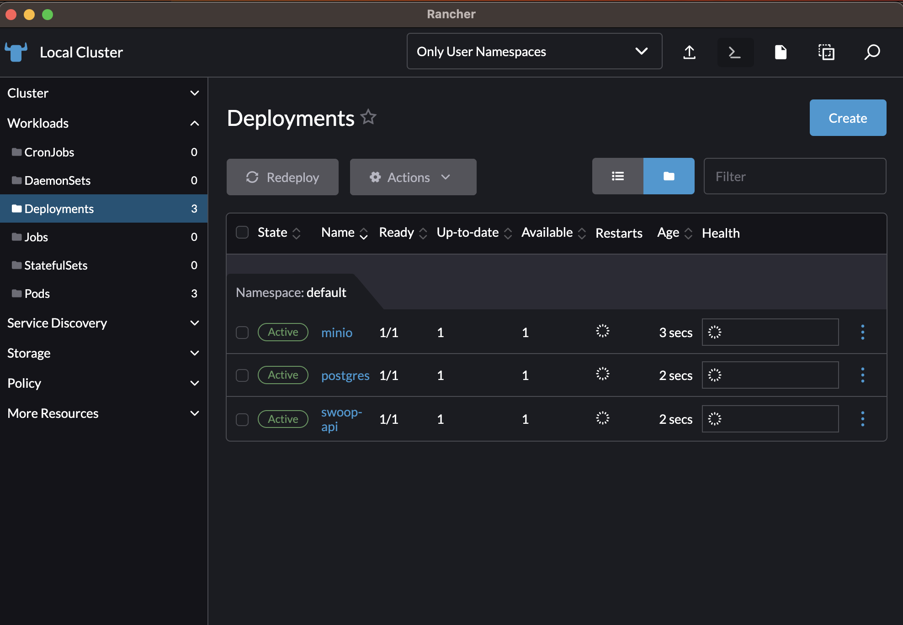
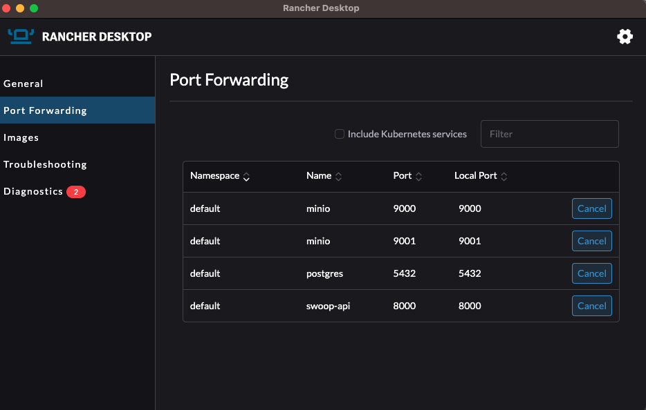
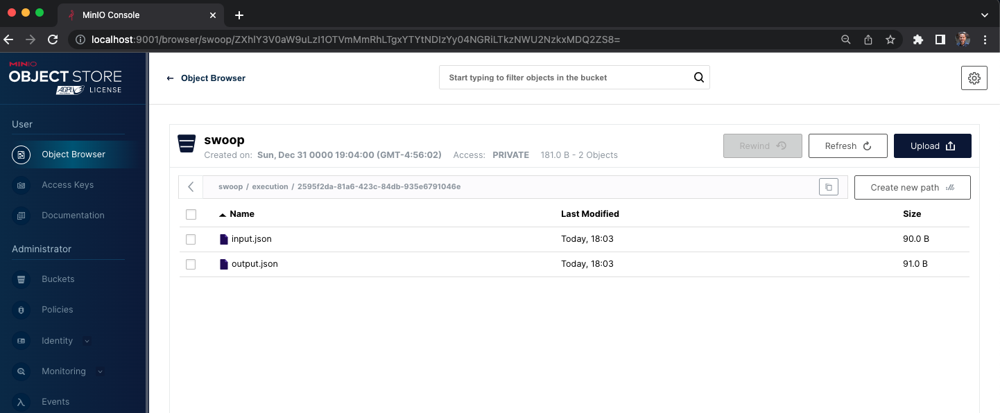

# Deployment

This helm chart will deploy [SWOOP API](https://github.com/Element84/swoop) onto a Kubernetes cluster.

## Adding FilmDrop Helm Chart Repository
To add the FilmDrop Helm Chart repository, do:

`helm repo add e84 https://element84.github.io/filmdrop-k8s-helm-charts`


## Installing SWOOP API and its dependencies
The [SWOOP API](https://github.com/Element84/swoop) will need an object storage for workflow artifacts and a postgres state database present.

You can either choose to install the MinIO and Postgres Helm Chart available on the FilmDrop Helm Chart Repository or you will need to have an existing MinIO/S3 backend with a Postgres installed and reachable to your SWOOP API.

To install the MinIO dependency run:
`helm install minio e84/minio`

To install the Postgres dependency run:
`helm install postgres e84/postgres`

To install SWOOP API run:
`helm install swoop-api e84/swoop-api`

Once the chart has been deployed, you should see at least 3 deployments: postgres, minio and swoop-api.
<br></br>
<p align="center">
  
</p>
<br></br>

In order to start using the services used by this helm chart, you will need to port-forward `postgres` onto localhost port `5432`, port-forward `minio` onto localhost ports `9000` & `9001` and port-forward `swoop-api` onto localhost port `8000`.
<br></br>
<p align="center">
  
</p>
<br></br>

You will see now, that if you reach the swoop api [http://localhost:8000/](http://localhost:8000/), you should see a sample response:
```
$ curl http://localhost:8000/

{"title":"Example processing server","description":"Example server implementing the OGC API - Processes 1.0 Standard","links":[{"href":"http://localhost:8000/conformance","rel":"http://www.opengis.net/def/rel/ogc/1.0/conformance","type":"application/json","hreflang":null,"title":null}]}%
```
<br></br>

## API tests with Database

To test the API endpoints that make use of data in the postgres database, you will need to load data into the postgres state database and the minio datastore. For steps, as well as test examples, please refer to the swoop repo [https://github.com/Element84/swoop](https://github.com/Element84/swoop).

If you want sample data to test the API, first clone the [https://github.com/Element84/swoop](https://github.com/Element84/swoop) repository locally, source the environment variables to your terminal, and then run the migrations and import the fixtures like the following:

After clonning the swoop repo, execute the following commands from the top level contents of the repo in your local terminal:
```
[swoop]$ source .env                                                       (main)

[swoop]$ dbmate up                                                         (main)
Creating schema: swoop
Applying: 20230412000000_base.sql
Applying: 20230501205418_cache.sql

[swoop]$ psql -p 5432 -U postgres swoop < db/fixtures/base_01.sql          (main)
INSERT 0 1
INSERT 0 1
INSERT 0 1
INSERT 0 1
INSERT 0 1
INSERT 0 1
INSERT 0 1
INSERT 0 1
```

After loading the database, you should be able to see the jobs in the swoop api jobs endpoint [http://localhost:8000/jobs/](http://localhost:8000/jobs/):
```
$ curl http://localhost:8000/jobs/

{"jobs":[{"processID":"action_2","type":"process","jobID":"81842304-0aa9-4609-89f0-1c86819b0752","status":"accepted","message":null,"created":null,"started":null,"finished":null,"updated":"2023-04-28T15:49:00+00:00","progress":null,"links":null,"parentID":"2595f2da-81a6-423c-84db-935e6791046e"},{"processID":"action_1","type":"process","jobID":"2595f2da-81a6-423c-84db-935e6791046e","status":"successful","message":null,"created":null,"started":null,"finished":null,"updated":"2023-04-28T15:49:03+00:00","progress":null,"links":null,"parentID":"cf8ff7f0-ce5d-4de6-8026-4e551787385f"}],"links":[{"href":"http://www.example.com","rel":null,"type":null,"hreflang":null,"title":null}]}%
```

## API tests with Object Storage

In order to load data into MinIO, follow these steps:

### Install First the MinIO client by running:
```
brew install minio/stable/mc
```

### Then set the MinIO alias, find the ACCESS_KEY and SECRET_KEY by quering the Helm values
```
export MINIO_ACCESS_KEY=`helm get values swoop-api -a -o json | jq -r .minio.service.accessKeyId | base64 --decode`
export MINIO_SECRET_KEY=`helm get values swoop-api -a -o json | jq -r .minio.service.secretAccessKey | base64 --decode`
mc alias set swoopminio http://127.0.0.1:9000 $MINIO_ACCESS_KEY $MINIO_SECRET_KEY
```

### Test MinIO connection by running:
```
$ mc admin info swoopminio

●  127.0.0.1:9000
   Uptime: 2 hours
   Version: 2023-05-18T00:05:36Z
   Network: 1/1 OK
   Drives: 1/1 OK
   Pool: 1

Pools:
   1st, Erasure sets: 1, Drives per erasure set: 1

0 B Used, 1 Bucket, 0 Objects
1 drive online, 0 drives offline
```

### Load data into MinIO by running:
```
$ mc cp --recursive tests/fixtures/io/base_01/ swoopminio/swoop/execution/2595f2da-81a6-423c-84db-935e6791046e/

...fixtures/io/base_01/output.json: 181 B / 181 B ━━━━━━━━━━━━━━━━━━━━━━━━━━━━━━━━━━━━━━━━ 1.67 KiB/s 0s
```

### View your data on MinIO by opening your browser on [http://localhost:9001/](http://localhost:9001/) and logging into MinIO
<p align="center">
  
</p>
<br></br>

### Test API with MinIO by running:
```
$ curl http://localhost:8000/jobs/2595f2da-81a6-423c-84db-935e6791046e/payload

{"process_id":"2595f2da-81a6-423c-84db-935e6791046e","payload":"test_input"}%
```

```
$ curl http://localhost:8000/jobs/2595f2da-81a6-423c-84db-935e6791046e/results

{"process_id":"2595f2da-81a6-423c-84db-935e6791046e","payload":"test_output"}%
```
<br></br>
## Uninstall swoop-api

To uninstall the release, do `helm uninstall swoop-api`.
