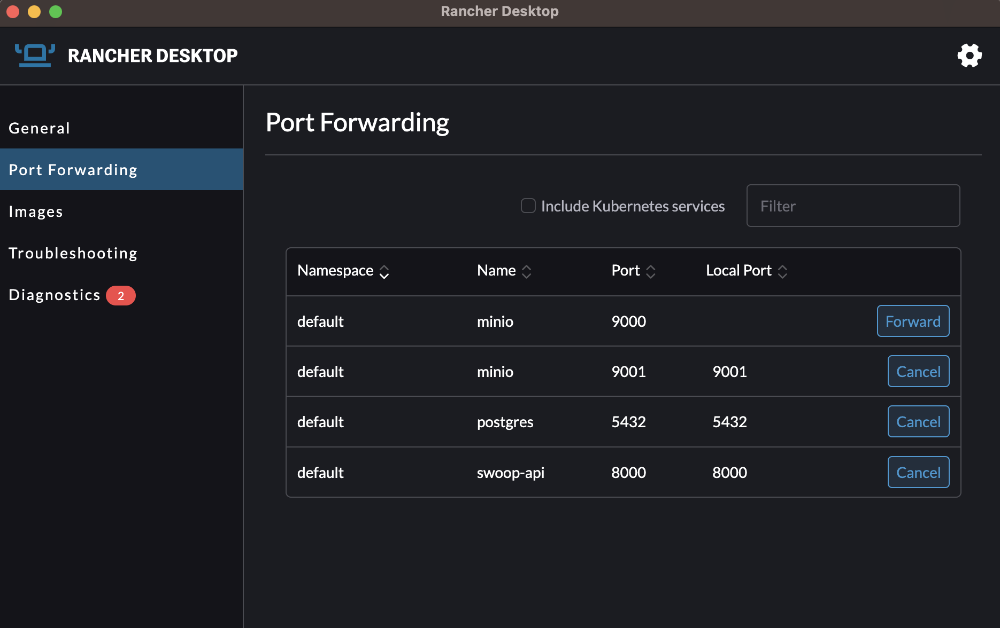

# Deployment

This helm chart will deploy [SWOOP API](https://github.com/Element84/swoop) onto a Kubernetes cluster.

To install the chart, do:

`helm repo add e84 https://element84.github.io/filmdrop-k8s-helm-charts`

and

`helm install swoop-api e84/swoop-api`

Once the chart has been deployed, you should see at least 3 deployments: postgres, minio and swoop-api.
<br></br>
<p align="center">
  
</p>
<br></br>

In order to start using the services used by this helm chart, you will need to port-forward `postgres` onto localhost port `5432`, port-forward `minio` onto localhost port `9001` and port-forward `swoop-api` onto localhost port `8000`.
<br></br>
<p align="center">
  
</p>
<br></br>

You will see now, that if you reach the swoop api [http://localhost:8000/](http://localhost:8000/), you should see a sample response:
```
$ curl http://localhost:8000/

{"title":"Example processing server","description":"Example server implementing the OGC API - Processes 1.0 Standard","links":[{"href":"http://localhost:8000/conformance","rel":"http://www.opengis.net/def/rel/ogc/1.0/conformance","type":"application/json","hreflang":null,"title":null}]}%
```

In order to utilize the full scope of the API, you will need to load data into the postgres state database and the minio datastore. For steps, as well as test examples, please refer to the swoop repo [https://github.com/Element84/swoop](https://github.com/Element84/swoop).


To uninstall the release, do `helm uninstall swoop-api`.
