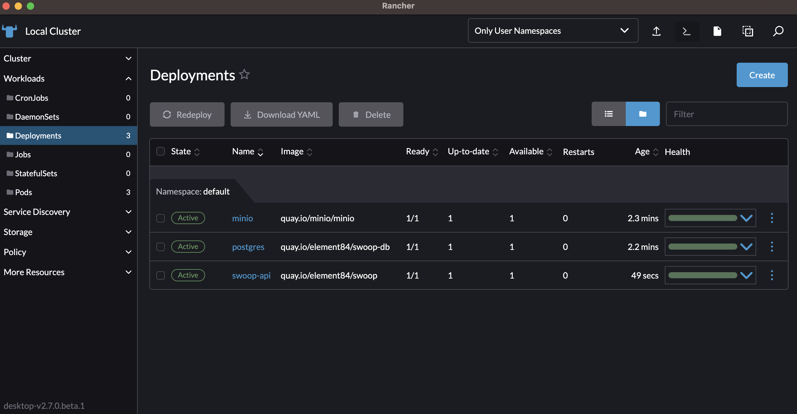
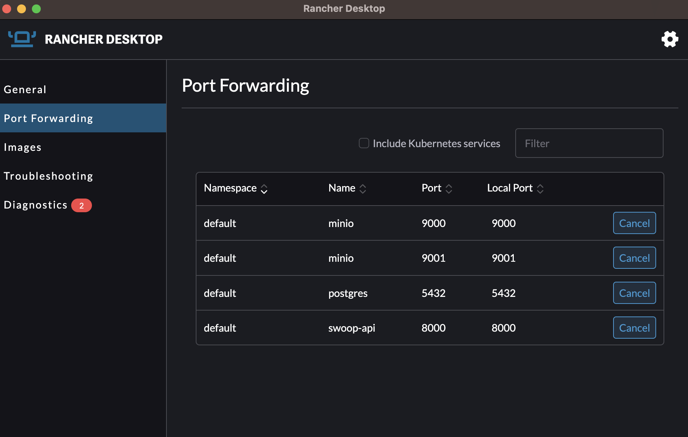

# Deployment

This helm chart will the following components into a kubernetes cluster:
* [swoop-api](https://github.com/Element84/swoop)
* [argo-workflows](https://github.com/argoproj/argo-workflows/)
* [swoop-caboose](https://github.com/Element84/swoop-go)
* [swoop-conductor](https://github.com/Element84/swoop-go)

## Adding FilmDrop Helm Chart Repository
To add the FilmDrop Helm Chart repository, do:

`helm repo add e84 https://element84.github.io/filmdrop-k8s-helm-charts`


## Installing SWOOP and its dependencies
The [SWOOP API](https://github.com/Element84/swoop) will need an object storage for workflow artifacts and a postgres state database present.

You can either choose to install the MinIO and Postgres Helm Chart available on the FilmDrop Helm Chart Repository or you will need to have an existing MinIO/S3 backend with a Postgres installed and reachable to your SWOOP API.

To install the MinIO dependency run:
`helm install minio e84/minio`

To install the Postgres dependency run:
`helm install postgres e84/postgres`

For waiting for the Postgres pods to be ready and initialize them prior initializing SWOOP DB:
```
kubectl wait --for=condition=ready --timeout=30m pod -l app=postgres
```

To initialize SWOOP DB run:
`helm install swoop-db-init e84/swoop-db-init`


For waiting for the SWOOP DB initialization to complete run:
```
kubectl wait --for=condition=complete --timeout=30m job -l app=swoop-db-init
```

To install SWOOP components:
`helm install swoop-bundle e84/swoop-bundle`

Once the chart has been deployed, you should see at least 3 deployments: postgres, minio and swoop-api.
<br></br>
<p align="center">
  
</p>
<br></br>

In order to start using the services used by this helm chart, you will need to port-forward `postgres` onto localhost port `5432`, port-forward `minio` onto localhost ports `9000` & `9001` and port-forward `swoop-api` onto localhost port `8000`.
<br></br>
<p align="center">
  
</p>
<br></br>

You will see now, that if you reach the swoop api [http://localhost:8000/](http://localhost:8000/), you should see a sample response:
```
$ curl http://localhost:8000/

{"title":"Example processing server","description":"Example server implementing the OGC API - Processes 1.0 Standard","links":[{"href":"http://localhost:8000/conformance","rel":"http://www.opengis.net/def/rel/ogc/1.0/conformance","type":"application/json","hreflang":null,"title":null}]}%
```
<br></br>

## API tests with Database

To test the API endpoints that make use of data in the postgres database, you will need to load data into the postgres state database or use [swoop-db](https://github.com/Element84/swoop-db) to initialize the schema and load test migrations.

If you want database sample data to test the API, run the following swoop-db command on the postgres pods to load test fixtures:
```
kubectl exec -it --namespace=default svc/postgres  -- /bin/sh -c "swoop-db load-fixture base_01"
```

After loading the database, you should be able to see the jobs in the swoop api jobs endpoint [http://localhost:8000/jobs/](http://localhost:8000/jobs/):
```
$ curl http://localhost:8000/jobs/

{"jobs":[{"processID":"action_2","type":"process","jobID":"81842304-0aa9-4609-89f0-1c86819b0752","status":"accepted","message":null,"created":null,"started":null,"finished":null,"updated":"2023-04-28T15:49:00+00:00","progress":null,"links":null,"parentID":"2595f2da-81a6-423c-84db-935e6791046e"},{"processID":"action_1","type":"process","jobID":"2595f2da-81a6-423c-84db-935e6791046e","status":"successful","message":null,"created":null,"started":null,"finished":null,"updated":"2023-04-28T15:49:03+00:00","progress":null,"links":null,"parentID":"cf8ff7f0-ce5d-4de6-8026-4e551787385f"}],"links":[{"href":"http://www.example.com","rel":null,"type":null,"hreflang":null,"title":null}]}%
```

## API tests with Object Storage
In order to load data into MinIO, follow these steps:

### Install First the MinIO client by running:
```
brew install minio/stable/mc
```

### Then set the MinIO alias, find the ACCESS_KEY and SECRET_KEY by quering the Helm values
```
export MINIO_ACCESS_KEY=`helm get values minio -a -o json | jq -r .service.accessKeyId | base64 --decode`
export MINIO_SECRET_KEY=`helm get values minio -a -o json | jq -r .service.secretAccessKey | base64 --decode`
mc alias set swoopminio http://127.0.0.1:9000 $MINIO_ACCESS_KEY $MINIO_SECRET_KEY
```

### Test MinIO connection by running:
```
$ mc admin info swoopminio

●  127.0.0.1:9000
   Uptime: 23 minutes
   Version: 2023-06-02T23:17:26Z
   Network: 1/1 OK
   Drives: 1/1 OK
   Pool: 1

Pools:
   1st, Erasure sets: 1, Drives per erasure set: 1

0 B Used, 1 Bucket, 0 Objects
1 drive online, 0 drives offline
```

### Load data into MinIO by running:
First clone the [https://github.com/Element84/swoop](https://github.com/Element84/swoop) repository locally, and then run the following from the top level of the your local swoop clone:

```
$ mc cp --recursive tests/fixtures/io/base_01/ swoopminio/swoop/execution/2595f2da-81a6-423c-84db-935e6791046e/

...fixtures/io/base_01/output.json: 181 B / 181 B ━━━━━━━━━━━━━━━━━━━━━━━━━━━━━━━━━━━━━━━━ 1.67 KiB/s 0s
```

### View your data on MinIO by opening your browser on [http://localhost:9001/](http://localhost:9001/) and logging into MinIO
<p align="center">
  
</p>
<br></br>

### Test API with MinIO by running:
```
$ curl http://localhost:8000/jobs/2595f2da-81a6-423c-84db-935e6791046e/payload

{"process_id":"2595f2da-81a6-423c-84db-935e6791046e","payload":"test_input"}%
```

```
$ curl http://localhost:8000/jobs/2595f2da-81a6-423c-84db-935e6791046e/results

{"process_id":"2595f2da-81a6-423c-84db-935e6791046e","payload":"test_output"}%
```
<br></br>

## Verifying SWOOP Caboose installation
Check the logs of the swoop-caboose pod and check your workers have started via:
```
$ kubectl get pods

NAME                                                              READY   STATUS    RESTARTS   AGE
minio-7c94499969-vm5ck                                            1/1     Running   0          6m37s
postgres-local-path-provisioner-6f78964c6d-ljpvm                  1/1     Running   0          6m16s
postgres-5b69c5f5d-dq9bv                                          1/1     Running   0          6m16s
swoop-bundle-argo-workflows-workflow-controller-6b64d7d9b-c4mbh   1/1     Running   0          2m37s
swoop-api-5575bc957d-5bnnk                                        1/1     Running   0          2m37s
swoop-caboose-77fc87775f-8lrl7                                    1/1     Running   0          2m37s
swoop-bundle-argo-workflows-server-56cc4f47f9-bgqtg               1/1     Running   0          2m37s
```

```
$ kubectl logs swoop-caboose-77fc87775f-8lrl7

time="2023-07-31T14:40:28Z" level=info msg="index config" indexWorkflowSemaphoreKeys=true
2023/07/31 14:40:28 starting worker 0
2023/07/31 14:40:28 starting worker 1
2023/07/31 14:40:28 starting worker 3
2023/07/31 14:40:28 starting worker 2
```
<br></br>


## Running an Argo workflow
For full documentation for argo workflows, please visit the [Argo Workflows Official Documentation](https://argoproj.github.io/argo-workflows/).

For a full list of customization values for the argo-workflows helm chart, visit [Argo Workflows ArtifactHub](https://artifacthub.io/packages/helm/argo/argo-workflows).

### Pre-requisites to running Argo Workflows example
You will need an AWS account, with an S3 bucket and an IAM user with read/write access to that bucket.

1. Go to your account in AWS, and create an S3 bucket for your assets, for example:
<br></br>
<p align="center">
  
</p>
<br></br>

2. Create an IAM user with a read/write policy to your bucket.
<br></br>
<p align="center">
  
</p>
<p align="center">
  
</p>
<br></br>

### Installation of Argo Workflows
Argo Workflows have been included as part of the swoop-bundle, as a dependency of swoop-caboose. To deploy argo workflows deploy the following helm charts in the same order:

To add the FilmDrop Helm Chart repository, do:

`helm repo add e84 https://element84.github.io/filmdrop-k8s-helm-charts`


To install the MinIO dependency run:
`helm install minio e84/minio`

To install the Postgres dependency run:
`helm install postgres e84/postgres`

For waiting for the Postgres pods to be ready and initialize them prior initializing SWOOP DB:
```
kubectl wait --for=condition=ready --timeout=30m pod -l app=postgres
```

To initialize SWOOP DB run:
`helm install swoop-db-init e84/swoop-db-init`


For waiting for the SWOOP DB initialization to complete run:
```
kubectl wait --for=condition=complete --timeout=30m job -l app=swoop-db-init
```

To install SWOOP components:
`helm install swoop-bundle e84/swoop-bundle`

### Running Argo Workflows Copy Assets Stac Task
The [copy-assets-stac-task](https://github.com/Element84/copy-assets-stac-task) example will run an argo workflow which copies specified Assets from Source STAC Item(s), uploads them to S3 and updates Item assets hrefs to point to the new location.

Now, prior to running the argo workflows example, first make sure to port-forward `minio` onto localhost ports `9000` & `9001`.

Via Rancher Desktop:
<br></br>
<p align="center">
  
</p>
<br></br>

or via terminal:

```
kubectl port-forward svc/minio 9000:9000 &
kubectl port-forward svc/minio 9001:9001 &
```

#### Install First the MinIO client by running

```
brew install minio/stable/mc
```

#### Then set the MinIO alias, find the ACCESS_KEY and SECRET_KEY by quering the Helm values

```
export MINIO_ACCESS_KEY=`helm get values minio -a -o json | jq -r .service.accessKeyId | base64 --decode`
export MINIO_SECRET_KEY=`helm get values minio -a -o json | jq -r .service.secretAccessKey | base64 --decode`
mc alias set swoopminio http://127.0.0.1:9000 $MINIO_ACCESS_KEY $MINIO_SECRET_KEY
```

####  Run the [copy-assets-stac-task](https://github.com/Element84/copy-assets-stac-task) argo workflow example

First clone the [copy-assets-stac-task](https://github.com/Element84/copy-assets-stac-task) repository.

After cloning the [copy-assets-stac-task](https://github.com/Element84/copy-assets-stac-task) repository, first proceed to modify the `payload_workflow.json` and replace the `<REPLACE_WITH_ASSETS_S3_BUCKET_NAME>` with the bucket name created on the [Pre-requisites section](#pre-requisites-to-running-argo-workflows-example).

Create a public minio local bucket and copy the `payload_workflow.json` file after replacing the `<REPLACE_WITH_ASSETS_S3_BUCKET_NAME>` name. To do this via the minio client:

```
$ mc mb swoopminio/payloadtest

Bucket created successfully `swoopminio/payloadtest`.
```
```
$ mc anonymous set public swoopminio/payloadtest

Access permission for `swoopminio/payloadtest` is set to `public`
```
```
$ mc cp ./payload_workflow.json swoopminio/payloadtest/

...opy-assets-stac-task/payload_workflow.json: 4.58 KiB / 4.58 KiB ━━━━━━━━━━━━━━━━━━━━━━━━━━━━━━━━━━━━━━━━━━━━━━━━━━━━━━━━━━━━━━━━━━━━━━━━━━━━━━━━━━━━━━━━━━━━━━━━━━━━━━━━━━━━━━━━━━━━━━━━━━━━━━━━━━━━━━━━━━━━━━━━━━━━━━━━━━━━━━━━━━━━━━━━━━━━━━━━━ 127.61 KiB/s 0s
```

Now modify the `secrets.yaml` and replace the `<REPLACE_WITH_BASE64_AWS_ACCESS_KEY>`, `<REPLACE_WITH_BASE64_AWS_SECRET_ACCESS_KEY>` and `<REPLACE_WITH_BASE64_AWS_REGION>` with the base64 encoded version of the AWS_ACCESS_KEY, AWS_SECRET_ACCESS_KEY and AWS_REGION of the iam user and bucket created on the [Pre-requisites section](#pre-requisites-to-running-argo-workflows-example).

Create the kubernetes secret by executing:
```
kubectl apply -n default -f ./secret.yaml
```

Then modify the `<REPLACE_WITH_MINIO_HOST>:<REPLACE_WITH_MINIO_PORT>` variables inside the `workflow_copyassets_no_template.yaml` and the `workflow_copyassets_with_template.yaml`. If you're running this example from a minio created by the terraform stack, you should be able to replace `<REPLACE_WITH_MINIO_HOST>:<REPLACE_WITH_MINIO_PORT>` with `minio.default:9000`.

Finally, run and watch the argo workflow task via:
```
argo submit -n default --watch ./workflow_copyassets_no_template.yaml
```

You should be able to see your workflow pod succeed in the terminal:
<br></br>
<p align="center">
  
</p>
<br></br>

And you should be able to see your asset S3 bucket populated with a thumbnail image:
```
aws s3 ls s3://<REPLACE_WITH_ASSETS_S3_BUCKET_NAME>/data/naip/tx_m_2609719_se_14_060_20201217/

2023-08-17 10:00:08       9776 thumbnail.jpg
```

Similarly, you should be able to run the `workflow_copyassets_with_template.yaml` workflow in the [copy-assets-stac-task](https://github.com/Element84/copy-assets-stac-task) repository by following these steps:

1. Create first the workflow template by the following command:
```
kubectl apply -f ./workflow-template.yaml
```
2. Submit the argo workflow by:
```
argo submit -n default --watch ./workflow_copyassets_with_template.yaml
```

<br></br>


Notes:
* When utilizing the argo workflow installation provided via the swoop-bundle, you should be able to run argo workflows in the following manner:
```
argo submit -n default --watch <FULL PATH TO THE SAMPLE WORKFLOW YAML FILE>
```
* The're is a service account created to support the required argo permissions `serviceAccountName: argo`
* You should not expect the argo server, nor archive logs to be functional with the default argo installation. In order to enable those settings please see:
  * [Argo Workflows Official Documentation](https://argoproj.github.io/argo-workflows/)
  * [Argo Workflows ArtifactHub](https://artifacthub.io/packages/helm/argo/argo-workflows)


<br></br>

## Running mirror workflow via swoop conductor

### Installing and configuring `workflow-config` helm chart

Create a bucket in S3 that will be used to hold your output assets from the workflow. Create an IAM user that has read/write permissions to this bucket and generate a set of AWS credentials (Access Key ID and Secret Access Key) for this user. These AWS credentials should have permissions to write to an S3 bucket where the output assets from the workflow will be uploaded.

Modify the `values.yaml` file for the `workflow-config` helm chart:

- Update the `artifactBucketName` value with the name of the MinIO bucket that contains the `input.json` file and will also eventually contain the `output.json` file once the workflow has completed.
- Update the `AWS Access Key ID`, `AWS Secret Access Key`, and `AWS Region` and/or `AWS Session Token` under the keys `s3.accessKeyId`, `s3.secretAccessKey`, `s3.region`, `s3.sessionToken`, respectively. These values contain dummy data and should be modified to include your AWS credentials. These AWS credentials should have permissions to write to an S3 bucket where the output assets from the workflow will be uploaded. Make sure you are using base-64 encoding for these values.
- Update the `minio.service.endpoint` value with the hostname and port name of the MinIO service. If you deployed MinIO from the helm chart, this should be `minio.default:9000`, respectively.
- Update the `serviceAccountName` with the name of the K8s service account that you want to use to run the workflow. Make sure that this account has the necessary permissions it needs.

Then, do:

`helm install workflow-config e84/workflow-config`

For more information about installing and configuring the `workflow-config` helm chart, please see the [readme](../workflow-config/README.md).

<br></br>

### Testing `swoop-conductor`
First port-forward swoop-api to your local port 8000:
```
kubectl port-forward -n default svc/swoop-api 8000:8000 &
```

Then clone the [copy-assets-stac-task](https://github.com/Element84/copy-assets-stac-task) repository locally, and then run the following from the top level of the your local copy-assets-stac-task clone:
```
python3 swoop_api_payload_test.py
```

The script will ask you for 2 inputs:
```
Enter SWOOP API Host (localhost:8000): localhost:8000
Enter STAC ASSETS BUCKET NAME: <REPLACE_WITH_ASSETS_S3_BUCKET_NAME>
```

Replace the <REPLACE_WITH_ASSETS_S3_BUCKET_NAME>` with an S3 Bucket name. The credentials that you configured in the previous "Installing and configuring workflow-config helm chart" section should have read and write access to this bucket.

You should see in the response a status of "accepted"
```
$ python3 swoop_api_payload_test.py

Enter SWOOP API Host (localhost:8000): localhost:8000
Enter STAC ASSETS BUCKET NAME: REDACTED_BUCKET_NAME
***** INPUTS SUMMARY *****
SWOOP API Host: localhost:8000
STAC ASSETS BUCKET NAME: REDACTED_BUCKET_NAME
POST URL: http://localhost:8000/processes/mirror/execution
POST Input payload:
{"inputs": {"payload": {"type": "FeatureCollection", "id": "tx_m_2609719_se_14_060_20201217", "features": [{"id": "tx_m_2609719_se_14_060_20201217", "bbox": [-97.690252, 26.622563, -97.622203, 26.689923], "type": "Feature", "links": [{"rel": "collection", "type": "application/json", "href": "https://planetarycomputer.microsoft.com/api/stac/v1/collections/naip"}, {"rel": "parent", "type": "application/json", "href": "https://planetarycomputer.microsoft.com/api/stac/v1/collections/naip"}, {"rel": "root", "type": "application/json", "href": "https://planetarycomputer.microsoft.com/api/stac/v1/"}, {"rel": "self", "type": "application/geo+json", "href": "https://planetarycomputer.microsoft.com/api/stac/v1/collections/naip/items/tx_m_2609719_se_14_060_20201217"}, {"rel": "preview", "href": "https://planetarycomputer.microsoft.com/api/data/v1/item/map?collection=naip&item=tx_m_2609719_se_14_060_20201217", "title": "Map of item", "type": "text/html"}], "assets": {"image": {"href": "https://naipeuwest.blob.core.windows.net/naip/v002/tx/2020/tx_060cm_2020/26097/m_2609719_se_14_060_20201217.tif", "type": "image/tiff; application=geotiff; profile=cloud-optimized", "roles": ["data"], "title": "RGBIR COG tile", "eo:bands": [{"name": "Red", "common_name": "red"}, {"name": "Green", "common_name": "green"}, {"name": "Blue", "common_name": "blue"}, {"name": "NIR", "common_name": "nir", "description": "near-infrared"}]}, "thumbnail": {"href": "https://naipeuwest.blob.core.windows.net/naip/v002/tx/2020/tx_060cm_2020/26097/m_2609719_se_14_060_20201217.200.jpg", "type": "image/jpeg", "roles": ["thumbnail"], "title": "Thumbnail"}}, "geometry": {"type": "Polygon", "coordinates": [[[-97.623004, 26.622563], [-97.622203, 26.689286], [-97.68949, 26.689923], [-97.690252, 26.623198], [-97.623004, 26.622563]]]}, "collection": "naip", "properties": {"version": 2, "gsd": 0.6, "datetime": "2020-12-17T00:00:00Z", "naip:year": "2020", "proj:bbox": [630384, 2945370, 637080, 2952762], "proj:epsg": 26914, "naip:state": "tx", "proj:shape": [12320, 11160], "proj:transform": [0.6, 0, 630384, 0, -0.6, 2952762, 0, 0, 1]}, "stac_extensions": ["https://stac-extensions.github.io/eo/v1.0.0/schema.json", "https://stac-extensions.github.io/projection/v1.0.0/schema.json"], "stac_version": "1.0.0"}], "process": [{"description": "string", "workflow": "mirror", "upload_options": {"path_template": "s3://REDACTED_BUCKET_NAME/data/${collection}/${id}/", "collections": {"naip": "*"}, "public_assets": [], "headers": {}, "s3_urls": false}, "tasks": {"copy-assets": {"assets": ["thumbnail"], "drop_assets": ["image"]}}}]}}, "response": "document"}
**************************
**** RESPONSE SUMMARY ****
Response from POST to http://localhost:8000/processes/mirror/execution:
 {"processID":"mirror","type":"process","jobID":"018a424a-9201-75c7-9455-e7326c776904","status":"accepted","message":null,"created":"2023-08-29T17:14:57.921969+00:00","started":null,"finished":null,"updated":"2023-08-29T17:14:57.921969+00:00","links":[{"href":"http://localhost:8000/","rel":"root","type":"application/json"},{"href":"http://localhost:8000/jobs/018a424a-9201-75c7-9455-e7326c776904","rel":"self","type":"application/json"},{"href":"http://localhost:8000/jobs/018a424a-9201-75c7-9455-e7326c776904/results","rel":"results","type":"application/json"},{"href":"http://localhost:8000/jobs/018a424a-9201-75c7-9455-e7326c776904/inputs","rel":"inputs","type":"application/json"},{"href":"http://localhost:8000/processes/mirror","rel":"process","type":"application/json"},{"href":"http://localhost:8000/payloadCacheEntries/f7ceceb1-5871-54c9-837d-d24380cb252b","rel":"cache","type":"application/json"}]}
**************************
```

You should see now a `018a424a-9201-75c7-9455-e7326c776904-copy-task-someid` pod matching the jobID `018a424a-9201-75c7-9455-e7326c776904` running via:
```
$ kubectl get pods

NAME                                                              READY   STATUS      RESTARTS   AGE
minio-78fc4699df-k9jsp                                            1/1     Running     0          7m33s
postgres-7b6b9ff76-hj4qs                                          1/1     Running     0          6m55s
db-initialization-8-cdqz9                                         0/1     Completed   0          6m22s
wait-for-db-initialization-8-2mdhf                                0/1     Completed   0          6m22s
migration-job-8-q442b                                             0/1     Completed   0          5m42s
swoop-caboose-argo-workflows-workflow-controller-86d7778c8fgfcl   1/1     Running     0          5m24s
swoop-caboose-78cdd68b7b-8dr7n                                    1/1     Running     0          5m24s
swoop-api-cdf497fc8-wmjgw                                         1/1     Running     0          4m24s
swoop-conductor-55fcb7d956-l6q22                                  1/1     Running     0          3m12s
018a424a-9201-75c7-9455-e7326c776904-copy-task-199703505          2/2     Running     0          51s
```

In a couple of minutes, the job will complete, and you will not see the pod running anymore with `kubectl get pods`.

Now if you run the same swoop-api test, with the same parameters, you will see the results from the cache with a status of `successful`:
```
$ python3 swoop_api_payload_test.py

Enter SWOOP API Host (localhost:8000): localhost:8000
Enter STAC ASSETS BUCKET NAME: REDACTED_BUCKET_NAME
***** INPUTS SUMMARY *****
SWOOP API Host: localhost:8000
STAC ASSETS BUCKET NAME: REDACTED_BUCKET_NAME
POST URL: http://localhost:8000/processes/mirror/execution
POST Input payload:
{"inputs": {"payload": {"type": "FeatureCollection", "id": "tx_m_2609719_se_14_060_20201217", "features": [{"id": "tx_m_2609719_se_14_060_20201217", "bbox": [-97.690252, 26.622563, -97.622203, 26.689923], "type": "Feature", "links": [{"rel": "collection", "type": "application/json", "href": "https://planetarycomputer.microsoft.com/api/stac/v1/collections/naip"}, {"rel": "parent", "type": "application/json", "href": "https://planetarycomputer.microsoft.com/api/stac/v1/collections/naip"}, {"rel": "root", "type": "application/json", "href": "https://planetarycomputer.microsoft.com/api/stac/v1/"}, {"rel": "self", "type": "application/geo+json", "href": "https://planetarycomputer.microsoft.com/api/stac/v1/collections/naip/items/tx_m_2609719_se_14_060_20201217"}, {"rel": "preview", "href": "https://planetarycomputer.microsoft.com/api/data/v1/item/map?collection=naip&item=tx_m_2609719_se_14_060_20201217", "title": "Map of item", "type": "text/html"}], "assets": {"image": {"href": "https://naipeuwest.blob.core.windows.net/naip/v002/tx/2020/tx_060cm_2020/26097/m_2609719_se_14_060_20201217.tif", "type": "image/tiff; application=geotiff; profile=cloud-optimized", "roles": ["data"], "title": "RGBIR COG tile", "eo:bands": [{"name": "Red", "common_name": "red"}, {"name": "Green", "common_name": "green"}, {"name": "Blue", "common_name": "blue"}, {"name": "NIR", "common_name": "nir", "description": "near-infrared"}]}, "thumbnail": {"href": "https://naipeuwest.blob.core.windows.net/naip/v002/tx/2020/tx_060cm_2020/26097/m_2609719_se_14_060_20201217.200.jpg", "type": "image/jpeg", "roles": ["thumbnail"], "title": "Thumbnail"}}, "geometry": {"type": "Polygon", "coordinates": [[[-97.623004, 26.622563], [-97.622203, 26.689286], [-97.68949, 26.689923], [-97.690252, 26.623198], [-97.623004, 26.622563]]]}, "collection": "naip", "properties": {"version": 2, "gsd": 0.6, "datetime": "2020-12-17T00:00:00Z", "naip:year": "2020", "proj:bbox": [630384, 2945370, 637080, 2952762], "proj:epsg": 26914, "naip:state": "tx", "proj:shape": [12320, 11160], "proj:transform": [0.6, 0, 630384, 0, -0.6, 2952762, 0, 0, 1]}, "stac_extensions": ["https://stac-extensions.github.io/eo/v1.0.0/schema.json", "https://stac-extensions.github.io/projection/v1.0.0/schema.json"], "stac_version": "1.0.0"}], "process": [{"description": "string", "workflow": "mirror", "upload_options": {"path_template": "s3://REDACTED_BUCKET_NAME/data/${collection}/${id}/", "collections": {"naip": "*"}, "public_assets": [], "headers": {}, "s3_urls": false}, "tasks": {"copy-assets": {"assets": ["thumbnail"], "drop_assets": ["image"]}}}]}}, "response": "document"}
**************************
**** RESPONSE SUMMARY ****
Response from POST to http://localhost:8000/processes/mirror/execution:
 {"processID":"mirror","type":"process","jobID":"018a424a-9201-75c7-9455-e7326c776904","status":"successful","created":"2023-08-29T17:14:57.921969+00:00","started":"2023-08-29T17:14:58+00:00","finished":"2023-08-29T17:16:00+00:00","updated":"2023-08-29T17:16:00+00:00","links":[{"href":"http://localhost:8000/","rel":"root","type":"application/json"},{"href":"http://localhost:8000/jobs/018a424a-9201-75c7-9455-e7326c776904","rel":"self","type":"application/json"},{"href":"http://localhost:8000/jobs/018a424a-9201-75c7-9455-e7326c776904/results","rel":"results","type":"application/json"},{"href":"http://localhost:8000/jobs/018a424a-9201-75c7-9455-e7326c776904/inputs","rel":"inputs","type":"application/json"},{"href":"http://localhost:8000/processes/mirror","rel":"process","type":"application/json"},{"href":"http://localhost:8000/payloadCacheEntries/f7ceceb1-5871-54c9-837d-d24380cb252b","rel":"cache","type":"application/json"}]}
**************************
```

Lastly, you should be able to see the output on MinIO.

First port-forward MinIO port 9000 via:
```
kubectl port-forward -n default svc/minio 9000:9000 &
```

Then connect to the MinIO client via:
```
export MINIO_ACCESS_KEY=`helm get values minio -a -o json | jq -r .service.accessKeyId | base64 --decode`
export MINIO_SECRET_KEY=`helm get values minio -a -o json | jq -r .service.secretAccessKey | base64 --decode`
mc alias set swoopminio http://127.0.0.1:9000 $MINIO_ACCESS_KEY $MINIO_SECRET_KEY
```

Check that you have an output file:
```
$ mc ls swoopminio/swoop/executions/018a424a-9201-75c7-9455-e7326c776904/

[2023-08-29 13:14:57 EDT] 2.5KiB STANDARD input.json
[2023-08-29 13:15:50 EDT] 2.1KiB STANDARD output.json
[2023-08-29 13:16:00 EDT] 5.0KiB STANDARD workflow.json
```

Copy the output file locally:
```
$ mc cp swoopminio/swoop/executions/018a424a-9201-75c7-9455-e7326c776904/output.json .

...7326c776904/output.json: 2.05 KiB / 2.05 KiB ━━━━━━━━━━━━━━━━━━━━━━━━━━━━━━━━━━━━━━━━━━━━━━━━━━━━━━━━━━━━━━━━━━━━━━━━━━━━━━━━━━━━━━━━━━━ 49.29 KiB/s 0s
```

Check the contents of the output.json:
```
$ cat output.json

{"type": "FeatureCollection", "features": [{"type": "Feature", "stac_version": "1.0.0", "id": "tx_m_2609719_se_14_060_20201217", "properties": {"version": 2, "gsd": 0.6, "datetime": "2020-12-17T00:00:00Z", "naip:year": "2020", "proj:bbox": [630384, 2945370, 637080, 2952762], "proj:epsg": 26914, "naip:state": "tx", "proj:shape": [12320, 11160], "proj:transform": [0.6, 0, 630384, 0, -0.6, 2952762, 0, 0, 1], "processing:software": {"copy-assets": "0.1.0"}}, "geometry": {"type": "Polygon", "coordinates": [[[-97.623004, 26.622563], [-97.622203, 26.689286], [-97.68949, 26.689923], [-97.690252, 26.623198], [-97.623004, 26.622563]]]}, "links": [{"rel": "collection", "href": "https://planetarycomputer.microsoft.com/api/stac/v1/collections/naip", "type": "application/json"}, {"rel": "parent", "href": "https://planetarycomputer.microsoft.com/api/stac/v1/collections/naip", "type": "application/json"}, {"rel": "self", "href": "https://planetarycomputer.microsoft.com/api/stac/v1/collections/naip/items/tx_m_2609719_se_14_060_20201217", "type": "application/geo+json"}, {"rel": "preview", "href": "https://planetarycomputer.microsoft.com/api/data/v1/item/map?collection=naip&item=tx_m_2609719_se_14_060_20201217", "type": "text/html", "title": "Map of item"}], "assets": {"thumbnail": {"href": "https://REDACTED_BUCKET_NAME.s3.us-west-2.amazonaws.com/data/naip/tx_m_2609719_se_14_060_20201217/thumbnail.jpg", "type": "image/jpeg", "title": "Thumbnail", "roles": ["thumbnail"]}}, "bbox": [-97.690252, 26.622563, -97.622203, 26.689923], "stac_extensions": ["https://stac-extensions.github.io/processing/v1.1.0/schema.json", "https://stac-extensions.github.io/eo/v1.0.0/schema.json", "https://stac-extensions.github.io/projection/v1.0.0/schema.json"], "collection": "naip"}], "process": {"description": "string", "tasks": {"copy-assets": {"assets": ["thumbnail"], "drop_assets": ["image"]}}, "upload_options": {"path_template": "s3://REDACTED_BUCKET_NAME/data/${collection}/${id}/", "collections": {"naip": "*"}, "public_assets": [], "headers": {}, "s3_urls": false}, "workflow": "mirror"}}%
```
<br></br>

## Uninstall swoop-bundle

To uninstall the release, do `helm uninstall swoop-bundle`.
