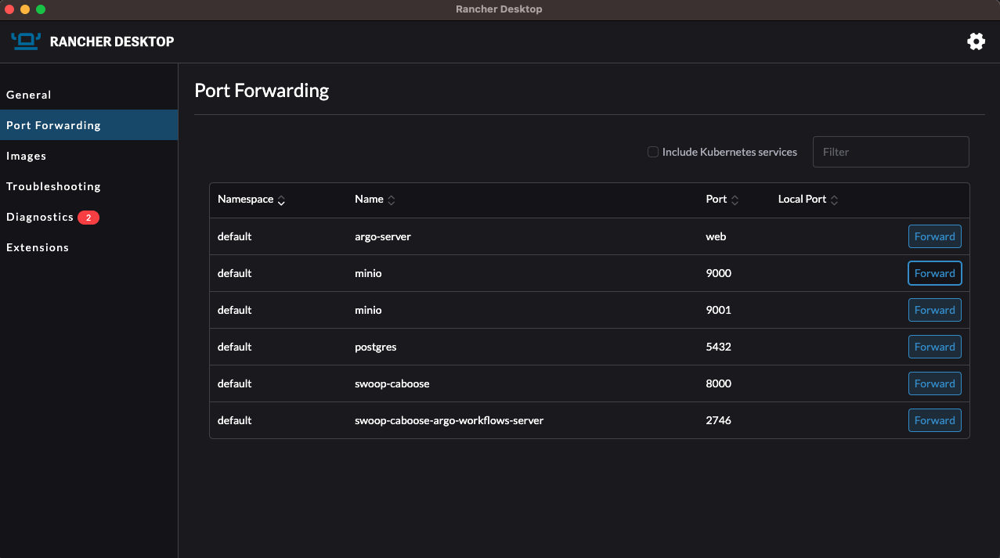

# Deployment

This helm chart will deploy [SWOOP Caboose](https://github.com/Element84/swoop-go) onto a Kubernetes cluster.

## Adding FilmDrop Helm Chart Repository
To add the FilmDrop Helm Chart repository, do:

`helm repo add e84 https://element84.github.io/filmdrop-k8s-helm-charts`


## Installing SWOOP Caboose and its dependencies
The [SWOOP Caboose](https://github.com/Element84/swoop-go) will need an object storage for workflow artifacts and a postgres state database present.

You can either choose to install the MinIO and Postgres Helm Chart available on the FilmDrop Helm Chart Repository or you will need to have an existing MinIO/S3 backend with a Postgres installed and reachable to your SWOOP Caboose.

To install the MinIO dependency run:
`helm install minio e84/minio`

To install the Postgres dependency:
`helm install postgres e84/postgres`


For waiting for the Postgres pods to be ready and initialize them prior installing SWOOP Caboose:
```
kubectl wait --for=condition=ready --timeout=30m pod -l app=postgres
kubectl exec -it --namespace=default svc/postgres  -- /bin/sh -c "swoop-db up"
kubectl exec -it --namespace=default svc/postgres  -- /bin/sh -c "swoop-db load-fixture base_01"
```

For waiting for the Minio pods to be ready and initialize them prior installing SWOOP Caboose, and port-forward ports 9000 and 9001:
```
kubectl wait --for=condition=ready --timeout=30m pod -l app=minio
kubectl port-forward -n default svc/minio 9000:9000 &
kubectl port-forward -n default svc/minio 9001:9001 &
```

### Install First the MinIO client by running:
```
brew install minio/stable/mc
```

### Then set the MinIO alias, find the ACCESS_KEY and SECRET_KEY by quering the Helm values
```
export MINIO_ACCESS_KEY=`helm get values swoop-caboose -a -o json | jq -r .minio.service.accessKeyId | base64 --decode`
export MINIO_SECRET_KEY=`helm get values swoop-caboose -a -o json | jq -r .minio.service.secretAccessKey | base64 --decode`
mc alias set swoopminio http://127.0.0.1:9000 $MINIO_ACCESS_KEY $MINIO_SECRET_KEY
```

### Test MinIO connection by running:
```
$ mc admin info swoopminio

●  127.0.0.1:9000
   Uptime: 23 minutes
   Version: 2023-06-02T23:17:26Z
   Network: 1/1 OK
   Drives: 1/1 OK
   Pool: 1

Pools:
   1st, Erasure sets: 1, Drives per erasure set: 1

0 B Used, 1 Bucket, 0 Objects
1 drive online, 0 drives offline
```

### Load data into MinIO by running:
First clone the [https://github.com/Element84/swoop](https://github.com/Element84/swoop) repository locally, and then run the following from the top level of the your local swoop clone:

```
$ mc cp --recursive tests/fixtures/io/base_01/ swoopminio/swoop/execution/2595f2da-81a6-423c-84db-935e6791046e/

...fixtures/io/base_01/output.json: 181 B / 181 B ━━━━━━━━━━━━━━━━━━━━━━━━━━━━━━━━━━━━━━━━ 1.67 KiB/s 0s
```

### View your data on MinIO by opening your browser on [http://localhost:9001/](http://localhost:9001/) and logging into MinIO
<p align="center">
  
</p>
<br></br>

To install SWOOP Caboose run:
`helm install swoop-caboose e84/swoop-caboose`

Once the chart has been deployed, you should see at least 3 deployments: postgres, minio and swoop-caboose.
<br></br>
<p align="center">
  
</p>
<br></br>

Check the logs of the swoop-caboose pod and check your workers have started via:
```
$ kubectl get pods

NAME                                                              READY   STATUS              RESTARTS   AGE
postgres-local-path-provisioner-6f78964c6d-f29j6                  1/1     Running             0          8m42s
postgres-5b69c5f5d-fsxpc                                          1/1     Running             0          8m42s
minio-7c94499969-xb2ds                                            1/1     Running             0          6m57s
swoop-caboose-77fc87775f-wczdt                                    0/1     ContainerCreating   0          24s
swoop-caboose-argo-workflows-workflow-controller-b5dfb48fdccz9x   1/1     Running             0          24s
workflow-controller-7c49cc575f-6h9lp                              1/1     Running             0          24s
argo-server-747fbdc4f8-ljj6p                                      0/1     Running             0          24s
swoop-caboose-argo-workflows-server-6d86c485b7-fj47w              0/1     Running             0          24s
```

```
$ kubectl logs swoop-caboose-77fc87775f-wczdt

time="2023-07-28T17:45:34Z" level=info msg="index config" indexWorkflowSemaphoreKeys=true
2023/07/28 17:45:34 starting worker 0
2023/07/28 17:45:34 starting worker 1
2023/07/28 17:45:34 starting worker 2
2023/07/28 17:45:34 starting worker 3
```

<br></br>
## Uninstall swoop-caboose

To uninstall the release, do `helm uninstall swoop-caboose`.
