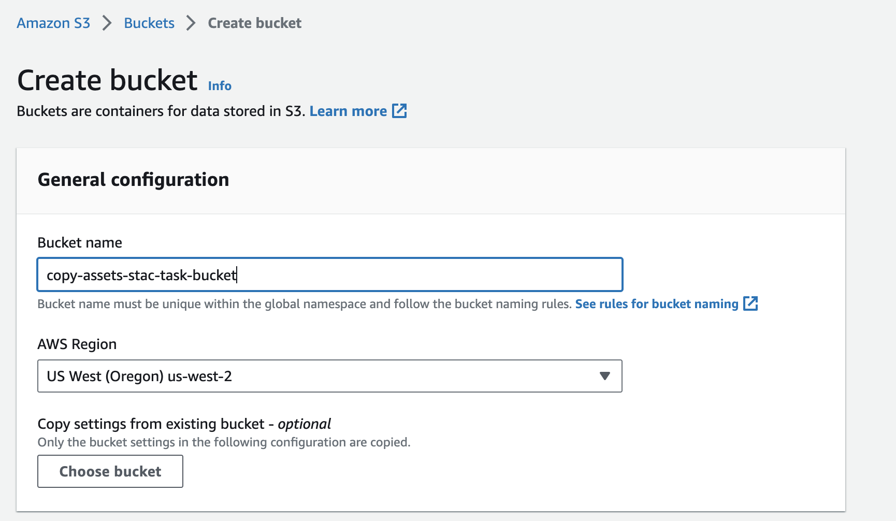
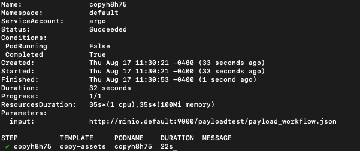

# Deployment

This helm chart will deploy [SWOOP Caboose](https://github.com/Element84/swoop-go) onto a Kubernetes cluster.

## Adding FilmDrop Helm Chart Repository
To add the FilmDrop Helm Chart repository, do:

`helm repo add e84 https://element84.github.io/filmdrop-k8s-helm-charts`


## Installing SWOOP Caboose and its dependencies
The [SWOOP Caboose](https://github.com/Element84/swoop-go) will need an object storage for workflow artifacts and a postgres state database present.

You can either choose to install the MinIO and Postgres Helm Chart available on the FilmDrop Helm Chart Repository or you will need to have an existing MinIO/S3 backend with a Postgres installed and reachable to your SWOOP Caboose.

To install the MinIO dependency run:
`helm install minio e84/minio`

To install the Postgres dependency:
`helm install postgres e84/postgres`

For waiting for the Postgres pods to be ready and initialize them prior initializing SWOOP DB:
```
kubectl wait --for=condition=ready --timeout=30m pod -l app=postgres
```

To initialize SWOOP DB run:
`helm install swoop-db-init e84/swoop-db-init`

For waiting for the SWOOP DB initialization to complete run:
```
kubectl wait --for=condition=complete --timeout=30m job -l app=swoop-db-init
```

To apply migration on SWOOP DB run:
`helm install swoop-db-migration e84/swoop-db-migration`

For waiting for the SWOOP DB migration to complete run:
```
kubectl wait --for=condition=complete --timeout=30m job -l app=swoop-db-migration
```

If you want database sample data to test with SWOOP Caboose, run the following swoop-db command on the postgres pods to load test fixtures:
```
kubectl exec -it --namespace=default svc/postgres  -- /bin/sh -c "swoop-db load-fixture base_01"
```

For waiting for the Minio pods to be ready and initialize them prior installing SWOOP Caboose, and port-forward ports 9000 and 9001:
```
kubectl wait --for=condition=ready --timeout=30m pod -l app=minio
kubectl port-forward -n default svc/minio 9000:9000 &
kubectl port-forward -n default svc/minio 9001:9001 &
```

### Install First the MinIO client by running:
```
brew install minio/stable/mc
```

### Then set the MinIO alias, find the ACCESS_KEY and SECRET_KEY by quering the Helm values
```
export MINIO_ACCESS_KEY=`helm get values minio -a -o json | jq -r .service.accessKeyId | base64 --decode`
export MINIO_SECRET_KEY=`helm get values minio -a -o json | jq -r .service.secretAccessKey | base64 --decode`
mc alias set swoopminio http://127.0.0.1:9000 $MINIO_ACCESS_KEY $MINIO_SECRET_KEY
```

### Test MinIO connection by running:
```
$ mc admin info swoopminio

●  127.0.0.1:9000
   Uptime: 23 minutes
   Version: 2023-06-02T23:17:26Z
   Network: 1/1 OK
   Drives: 1/1 OK
   Pool: 1

Pools:
   1st, Erasure sets: 1, Drives per erasure set: 1

0 B Used, 1 Bucket, 0 Objects
1 drive online, 0 drives offline
```

### Load data into MinIO by running:
First clone the [https://github.com/Element84/swoop](https://github.com/Element84/swoop) repository locally, and then run the following from the top level of the your local swoop clone:

```
$ mc cp --recursive tests/fixtures/io/base_01/ swoopminio/swoop/execution/2595f2da-81a6-423c-84db-935e6791046e/

...fixtures/io/base_01/output.json: 181 B / 181 B ━━━━━━━━━━━━━━━━━━━━━━━━━━━━━━━━━━━━━━━━ 1.67 KiB/s 0s
```

### View your data on MinIO by opening your browser on [http://localhost:9001/](http://localhost:9001/) and logging into MinIO
<p align="center">
  
</p>
<br></br>

To install SWOOP Caboose run:
`helm install swoop-caboose e84/swoop-caboose`

Once the chart has been deployed, you should see at least 3 deployments: postgres, minio and swoop-caboose.
<br></br>
<p align="center">
  
</p>
<br></br>


Check the logs of the swoop-caboose pod and check your workers have started via:
```
$ kubectl get pods

NAME                                                              READY   STATUS              RESTARTS   AGE
postgres-local-path-provisioner-6f78964c6d-f29j6                  1/1     Running             0          8m42s
postgres-5b69c5f5d-fsxpc                                          1/1     Running             0          8m42s
minio-7c94499969-xb2ds                                            1/1     Running             0          6m57s
swoop-caboose-77fc87775f-wczdt                                    0/1     ContainerCreating   0          24s
swoop-caboose-argo-workflows-workflow-controller-b5dfb48fdccz9x   1/1     Running             0          24s
workflow-controller-7c49cc575f-6h9lp                              1/1     Running             0          24s
argo-server-747fbdc4f8-ljj6p                                      0/1     Running             0          24s
swoop-caboose-argo-workflows-server-6d86c485b7-fj47w              0/1     Running             0          24s
```

```
$ kubectl logs swoop-caboose-77fc87775f-wczdt

time="2023-07-28T17:45:34Z" level=info msg="index config" indexWorkflowSemaphoreKeys=true
2023/07/28 17:45:34 starting worker 0
2023/07/28 17:45:34 starting worker 1
2023/07/28 17:45:34 starting worker 2
2023/07/28 17:45:34 starting worker 3
```
<br></br>
## Running an Argo workflow
For full documentation for argo workflows, please visit the [Argo Workflows Official Documentation](https://argoproj.github.io/argo-workflows/).

For a full list of customization values for the argo-workflows helm chart, visit [Argo Workflows ArtifactHub](https://artifacthub.io/packages/helm/argo/argo-workflows).

### Pre-requisites to running Argo Workflows example
You will need an AWS account, with an S3 bucket and an IAM user with read/write access to that bucket.

1. Go to your account in AWS, and create an S3 bucket for your assets, for example:
<br></br>
<p align="center">
  
</p>
<br></br>

2. Create an IAM user with a read/write policy to your bucket.
<br></br>
<p align="center">
  
</p>
<p align="center">
  
</p>
<br></br>

### Installation of Argo Workflows
Argo Workflows have been included as part of the swoop-bundle, as a dependency of swoop-caboose. To deploy argo workflows deploy the following helm charts in the same order:

To add the FilmDrop Helm Chart repository, do:

`helm repo add e84 https://element84.github.io/filmdrop-k8s-helm-charts`


To install the MinIO dependency run:
`helm install minio e84/minio`

To install the Postgres dependency run:
`helm install postgres e84/postgres`

For waiting for the Postgres pods to be ready and initialize them prior initializing SWOOP DB:
```
kubectl wait --for=condition=ready --timeout=30m pod -l app=postgres
```

To initialize SWOOP DB run:
`helm install swoop-db-init e84/swoop-db-init`


For waiting for the SWOOP DB initialization to complete run:
```
kubectl wait --for=condition=complete --timeout=30m job -l app=swoop-db-init
```

To install SWOOP Caboose run:
`helm install swoop-caboose e84/swoop-caboose`

### Running Argo Workflows Copy Assets Stac Task
The [copy-assets-stac-task](https://github.com/Element84/copy-assets-stac-task) example will run an argo workflow which copies specified Assets from Source STAC Item(s), uploads them to S3 and updates Item assets hrefs to point to the new location.

Now, prior to running the argo workflows example, first make sure to port-forward `minio` onto localhost ports `9000` & `9001`.

Via Rancher Desktop:
<br></br>
<p align="center">
  
</p>
<br></br>

or via terminal:

```
kubectl port-forward svc/minio 9000:9000 &
kubectl port-forward svc/minio 9001:9001 &
```

#### Install First the MinIO client by running

```
brew install minio/stable/mc
```

#### Then set the MinIO alias, find the ACCESS_KEY and SECRET_KEY by quering the Helm values

```
export MINIO_ACCESS_KEY=`helm get values minio -a -o json | jq -r .service.accessKeyId | base64 --decode`
export MINIO_SECRET_KEY=`helm get values minio -a -o json | jq -r .service.secretAccessKey | base64 --decode`
mc alias set swoopminio http://127.0.0.1:9000 $MINIO_ACCESS_KEY $MINIO_SECRET_KEY
```

####  Run the [copy-assets-stac-task](https://github.com/Element84/copy-assets-stac-task) argo workflow example

First clone the [copy-assets-stac-task](https://github.com/Element84/copy-assets-stac-task) repository.

After cloning the [copy-assets-stac-task](https://github.com/Element84/copy-assets-stac-task) repository, first proceed to modify the `payload_workflow.json` and replace the `<REPLACE_WITH_ASSETS_S3_BUCKET_NAME>` with the bucket name created on the [Pre-requisites section](#pre-requisites-to-running-argo-workflows-example).

Create a public minio local bucket and copy the `payload_workflow.json` file after replacing the `<REPLACE_WITH_ASSETS_S3_BUCKET_NAME>` name. To do this via the minio client:

```
$ mc mb swoopminio/payloadtest

Bucket created successfully `swoopminio/payloadtest`.
```
```
$ mc anonymous set public swoopminio/payloadtest

Access permission for `swoopminio/payloadtest` is set to `public`
```
```
$ mc cp ./payload_workflow.json swoopminio/payloadtest/

...opy-assets-stac-task/payload_workflow.json: 4.58 KiB / 4.58 KiB ━━━━━━━━━━━━━━━━━━━━━━━━━━━━━━━━━━━━━━━━━━━━━━━━━━━━━━━━━━━━━━━━━━━━━━━━━━━━━━━━━━━━━━━━━━━━━━━━━━━━━━━━━━━━━━━━━━━━━━━━━━━━━━━━━━━━━━━━━━━━━━━━━━━━━━━━━━━━━━━━━━━━━━━━━━━━━━━━━ 127.61 KiB/s 0s
```

Now modify the `secrets.yaml` and replace the `<REPLACE_WITH_BASE64_AWS_ACCESS_KEY>`, `<REPLACE_WITH_BASE64_AWS_SECRET_ACCESS_KEY>` and `<REPLACE_WITH_BASE64_AWS_REGION>` with the base64 encoded version of the AWS_ACCESS_KEY, AWS_SECRET_ACCESS_KEY and AWS_REGION of the iam user and bucket created on the [Pre-requisites section](#pre-requisites-to-running-argo-workflows-example).

Create the kubernetes secret by executing:
```
kubectl apply -n default -f ./secret.yaml
```

Then modify the `<REPLACE_WITH_MINIO_HOST>:<REPLACE_WITH_MINIO_PORT>` variables inside the `workflow_copyassets_no_template.yaml` and the `workflow_copyassets_with_template.yaml`. If you're running this example from a minio created by the terraform stack, you should be able to replace `<REPLACE_WITH_MINIO_HOST>:<REPLACE_WITH_MINIO_PORT>` with `minio.default:9000`.

Finally, run and watch the argo workflow task via:
```
argo submit -n default --watch ./workflow_copyassets_no_template.yaml
```

You should be able to see your workflow pod succeed in the terminal:
<br></br>
<p align="center">
  
</p>
<br></br>

And you should be able to see your asset S3 bucket populated with a thumbnail image:
```
aws s3 ls s3://<REPLACE_WITH_ASSETS_S3_BUCKET_NAME>/data/naip/tx_m_2609719_se_14_060_20201217/

2023-08-17 10:00:08       9776 thumbnail.jpg
```

Similarly, you should be able to run the `workflow_copyassets_with_template.yaml` workflow in the [copy-assets-stac-task](https://github.com/Element84/copy-assets-stac-task) repository by following these steps:

1. Create first the workflow template by the following command:
```
kubectl apply -f ./workflow-template.yaml
```
2. Submit the argo workflow by:
```
argo submit -n default --watch ./workflow_copyassets_with_template.yaml
```

<br></br>


Notes:
* When utilizing the argo workflow installation provided via the swoop-bundle, you should be able to run argo workflows in the following manner:
```
argo submit -n default --watch <FULL PATH TO THE SAMPLE WORKFLOW YAML FILE>
```
* The're is a service account created to support the required argo permissions `serviceAccountName: argo`
* You should not expect the argo server, nor archive logs to be functional with the default argo installation. In order to enable those settings please see:
  * [Argo Workflows Official Documentation](https://argoproj.github.io/argo-workflows/)
  * [Argo Workflows ArtifactHub](https://artifacthub.io/packages/helm/argo/argo-workflows)


<br></br>
## Uninstall swoop-caboose

To uninstall the release, do `helm uninstall swoop-caboose`.
