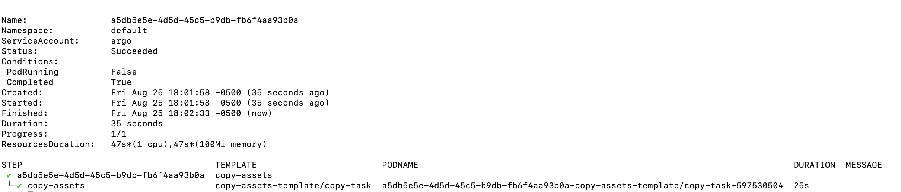

# Deployment

This chart deploys the SWOOP configuration file and workflow/task templates onto a K8s cluster. It will only _deploy_ these resources, and will not _run_ any workflows.

The SWOOP configuration file contains the high-level configuration parameters and values used by SWOOP components such as workflows, callbacks, conductors, and handlers, to run workflows on the cluster. The configuration file is located at `./swoop-config.yaml`.

The workflow templates contain more detailed configurations used by each individual workflow to run, and describe their tasks, input and output artifacts, any additional workflow templates referenced by the main workflow (if any), and secrets being used. Workflow templates are contained within the `./workflows/` directory and task templates (which are also of `kind: WorkflowTemplate`) are contained in the `./tasks/` directory.

The workflow-config helm chart uses Argo Workflows since the WorkflowTemplate resources are Argo-specific configurations.

Currently, workflow templates for only one workflow (the `mirror-workflow`, which copies specified assets from source STAC items from one location to AWS S3) have been provided through this helm chart.

To add the FilmDrop Helm Chart repository, do:

`helm repo add e84 https://element84.github.io/filmdrop-k8s-helm-charts`

Install the below helm charts **in order**:

`helm install minio e84/minio`

`helm install postgres e84/postgres`

`helm install swoop-db-init e84/swoop-db-init`

`helm install swoop-db-migration e84/swoop-db-migration`

`helm install swoop-caboose e84/swoop-caboose`

Note: the `swoop-caboose` helm chart will also install Argo Workflows as a dependency.

To simple install the workflow-config helm chart without running any workflow, simply do:

`helm install workflow-config e84/workflow-config`

This will deploy the Swoop configuration file as a configmap and the templates for the mirror workflow as Argo WorkflowTemplate resources onto the cluster.

Once the chart has been deployed, you can do:

`kubectl get workflowtemplate` and

`kubectl get configmap`

to see that the workflow templates and SWOOP configmap were deployed.

To install the helm chart _and_ run the sample mirror workflow, follow the steps in the next section.

## Running the mirror workflow

Create a bucket in S3 that will be used to hold your output assets from the workflow. Create an IAM user that has read/write permissions to this bucket and generate a set of AWS credentials (Access Key ID and Secret Access Key) for this user. These AWS credentials should have permissions to write to an S3 bucket where the output assets from the workflow will be uploaded.

Create an `input.json` file for the input payload.

Modify the `process/upload_options/path_template`property of the input payload to contain the bucket name of the S3 bucket created in the previous step. For example, if the bucket is named `mirrorworkflowoutput`, the `path_template` should be:

`"path_template": "s3://mirrorworkflowoutput/data/${collection}/${id}/"`

This is a sample UUID used for this example. Enter this in the command line.
`UUID='a5db5e5e-4d5d-45c5-b9db-fb6f4aa93b0a'`

Upload the `input.json` file to a MinIo bucket. Replace the <PATH_TO_INPUT.JSON> with the path to your `input.json` file.

```
export MINIO_ACCESS_KEY=`helm get values minio -a -o json | jq -r .service.accessKeyId | base64 --decode`
export MINIO_SECRET_KEY=`helm get values minio -a -o json | jq -r .service.secretAccessKey | base64 --decode`
mc alias set swoopminio http://127.0.0.1:9000 $MINIO_ACCESS_KEY $MINIO_SECRET_KEY
mc cp  <PATH_TO_INPUT.JSON> swoopminio/swoop/executions/${UUID}/input.json
```

Then, modify the `values.yaml` file for the `workflow-config` helm chart:

- Update the `artifactBucketName` value with the name of the MinIO bucket that contains the `input.json` file and will also eventually contain the `output.json` file once the workflow has completed.
- Update the `AWS Access Key ID`, `AWS Secret Access Key`, and `AWS Region` and/or `AWS Session Token` under the keys `s3.accessKeyId`, `s3.secretAccessKey`, `s3.region`, `s3.sessionToken`, and `s3.dataBucket`, respectively. These values contain dummy data and should be modified to include your AWS credentials. These AWS credentials should have permissions to write to an S3 bucket where the output assets from the workflow will be uploaded. Make sure you are using base-64 encoding for these values.
- Update the `minio.service.endpoint` value with the hostname and port name of the MinIO service. If you deployed MinIO from the helm chart, this should be `minio.default:9000`, respectively.
- Update the `serviceAccountName` with the name of the K8s service account that you want to use to run the workflow. Make sure that this account has the necessary permissions it needs.

Then, do:

`helm install workflow-config e84/workflow-config`

To submit the mirror workflow, run:

`argo submit --watch --from workflowtemplate/mirror-workflow --name $UUID`

The workflow will run to completion and you will see that is has successfully run in the console. You can also see the output item asset in the S3 bucket.

<br></br>
<p align="center">
  
</p>
<br></br>

## Adding/modifying workflow configurations

To add/update workflow configurations, either:

- modify the `swoop-config.yaml` file in the root directory with the new configuration parameters for the appropriate SWOOP component - handlers, conductors, callbacks, and/or workflows.
- modify the template for the appropriate workflow in the `./workflows` directory or the task used by that workflow in the `./tasks` directory.
